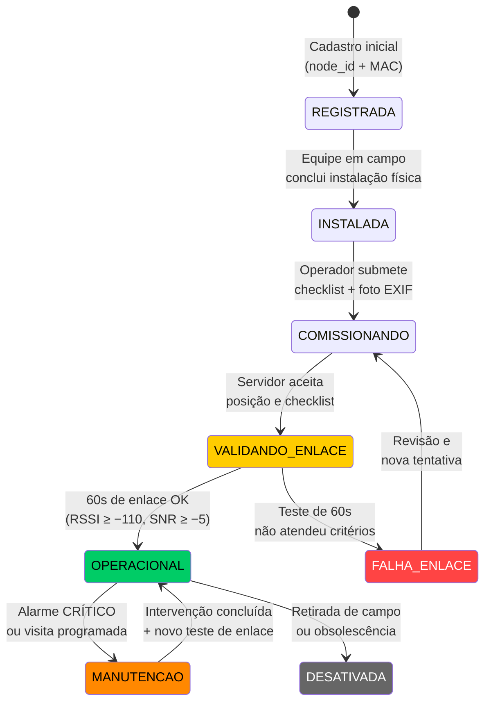
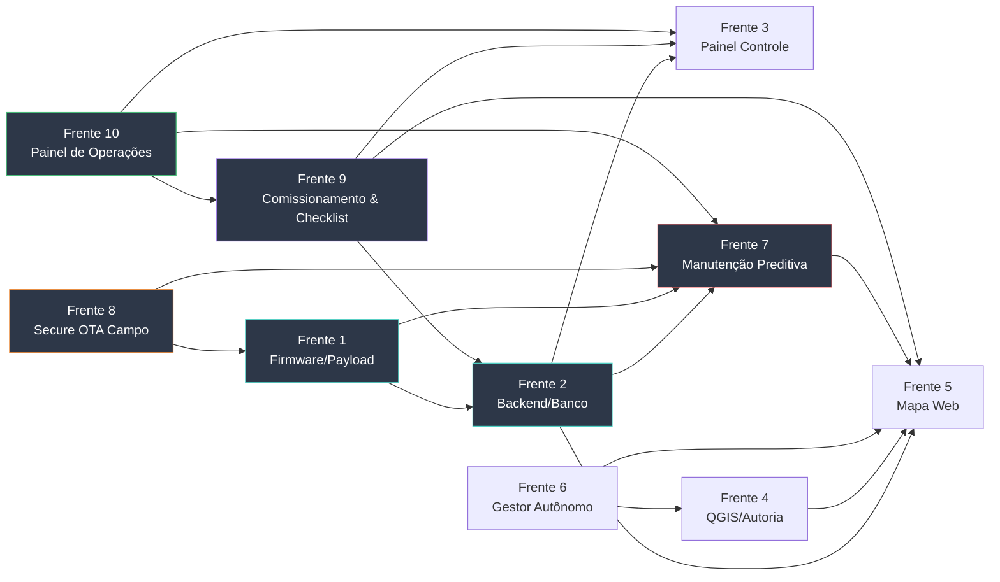

# Caderno de Planejamento e Insights do Projeto Sentinela (`antigravityplan.md`)
> **Finalidade:** Este arquivo centraliza todas as análises, descobertas de bancada/campo, diretrizes de arquitetura e especificações técnicas de maturação do **Projeto Sentinela**. Serve como base de conhecimento e registro oficial para o trabalho integrado das equipes de desenvolvimento.

---

## 1. Diretrizes Invioláveis do Projeto

Todas as propostas, especificações e implementações futuras **devem obedecer rigorosamente** aos seguintes princípios estabelecidos na documentação de base:

1. **Complexidade Ciclomática $\le 10$ ([QUALIDADE_CODIGO.md](file:///Users/matheus/Documents/Claude%20Projects/Sentinela/docs/QUALIDADE_CODIGO.md)):**
   - Nenhuma função em C/C++ ou Python pode ultrapassar $CC = 10$.
   - A complexidade é verificada via `./tools/venv/bin/python tools/complexidade.py --limite 10`.

2. **Falha Explícita e Integridade ([RC-07](file:///Users/matheus/Documents/Claude%20Projects/Sentinela/docs/REQUISITOS.md#L43)):**
   - Sensores ou componentes descalibrados/com defeito devem ser reportados expressamente (ex: tensão de bateria marcada como `nc`).
   - É expressamente proibido mascarar erros com dados fictícios, fallbacks omissos ou try/except genéricos.

3. **Política de Citação e Rastreabilidade ([REFERENCIAS.md](file:///Users/matheus/Documents/Claude%20Projects/Sentinela/docs/REFERENCIAS.md)):**
   - Toda constante, limiar ou afirmação técnica deve possuir tag de proveniência (`[M]`, `[N]`, `[L]`, `[G]`, `[E]`).
   - Afirmações geotécnicas, geológicas ou geográficas **não podem ser marcadas com `[E]`** — exigem respaldo de norma, literatura ou órgão governamental.

4. **Tripla Camada de Responsabilidade Técnica ([RESPONSABILIDADE_TECNICA.md](file:///Users/matheus/Documents/Claude%20Projects/Sentinela/docs/RESPONSABILIDADE_TECNICA.md)):**
   - **Camada 1 (Produto):** Instrumento, firmware e hardware (Mecatrônica / ADS via CRT/CFT).
   - **Camada 2 (Geotecnia/Aplicação):** Laudos de estabilidade de talude, posição de sensores e interpretação geotécnica **exigem Engenheiro Geotécnico ou Geólogo com ART (CREA)**.
   - **Camada 3 (Decisão):** Atribuição exclusiva do Poder Público / Defesa Civil ([RC-00](file:///Users/matheus/Documents/Claude%20Projects/Sentinela/docs/REQUISITOS.md#L15)).

5. **Apoio à Decisão, Nunca Acionamento Autônomo ([RC-00](file:///Users/matheus/Documents/Claude%20Projects/Sentinela/docs/REQUISITOS.md#L15)):**
   - O sistema **não aciona evacuação de forma autônoma** e não substitui julgamento técnico.
   - Todo material, interface, alerta e documentação devem refletir isso explicitamente.

6. **Posicionamento Competitivo Correto ([NEGOCIO.md §4](file:///Users/matheus/Documents/Claude%20Projects/Sentinela/docs/NEGOCIO.md#L39), [CONCORRENCIA.md](file:///Users/matheus/Documents/Claude%20Projects/Sentinela/docs/CONCORRENCIA.md)):**
   - O hardware não é o diferencial; a originalidade defensável está na **referência distribuída**, na **integração geoespacial** e no **custo por ponto**.
   - O Sentinela concorre com o **nada** que existe no talude municipal, não com instrumentação premium de barragem.

---

## 2. Fatos e Descobertas Consolidadas

### 2.1. Hardware e Plataforma de Rádio
- **Placa de Bancada:** Heltec WiFi LoRa 32 V2 (ESP32 + SX1276).
- **Parâmetros Físicos Resolvidos:**
  - Flash real de **4 MB** (Winbond `ef:4016`) fixada no `platformio.ini` ([E-005](file:///Users/matheus/Documents/Claude%20Projects/Sentinela/ERROS.md#L68)).
  - Baudrate máximo confiável no CP2102: **`230400`** ([E-001](file:///Users/matheus/Documents/Claude%20Projects/Sentinela/ERROS.md#L25)).
  - Frequência LoRa P2P em **`916.8 MHz`** / LoRaWAN em **AU915 Sub-banda 2** ([ADR-003](file:///Users/matheus/Documents/Claude%20Projects/Sentinela/docs/ARQUITETURA.md#L82)), respeitando a Resolução Anatel 680/2017 e Ato 14448/2017.
  - Tensão de alimentação de periféricos/display chaveada por `Vext` (GPIO 21), ativo em nível **BAIXO** ([A-004](file:///Users/matheus/Documents/Claude%20Projects/Sentinela/ERROS.md#L273)).
- **Proteção do Amplificador de Potência (PA):**
  - **NUNCA** gravar firmware RF-ativo (`node_dev`, `node_range`) em placas sem antena física ([A-003](file:///Users/matheus/Documents/Claude%20Projects/Sentinela/ERROS.md#L268) / [A-010](file:///Users/matheus/Documents/Claude%20Projects/Sentinela/ERROS.md#L319)).
  - Placas de teste sem antena devem rodar obrigatoriamente o papel passivo `ROLE_BENCH`.
  - Executar sempre `esptool.py flash_id` antes de qualquer gravação para confirmar o endereço MAC ([E-007](file:///Users/matheus/Documents/Claude%20Projects/Sentinela/ERROS.md#L143)).

### 2.2. Enlace e Propagação de Campo
- **Modelo de Atenuação em Encosta Florestada (`[M]` Ensaio 02):**
  $$PL(d) = PL(d_0) + 10 \cdot n \cdot \log_{10}\left(\frac{d}{d_0}\right) + X_\sigma, \quad n = 3,28$$
- **Atenuação sob Tempestade ([REFERENCIAS.md §5.3](file:///Users/matheus/Documents/Claude%20Projects/Sentinela/docs/REFERENCIAS.md#L323)):**
  - Em $900\,\text{MHz}$, a atenuação por gotas de chuva é desprezível ($\approx 0,0002\,\text{dB/200m}$ via ITU-R P.838-3).
  - A perda de margem durante tempestades é provocada pela umidade retida no dossel vegetal e reflexões em superfícies encharcadas (ITU-R P.833-10).
- **Ganho de Antena — Regra Regulatória Resolvida ([CONFORMIDADE.md §1.1.1](file:///Users/matheus/Documents/Claude%20Projects/Sentinela/docs/CONFORMIDADE.md#L44)):**
  - **6 dBi é o ganho de referência.** Acima disso, a potência conduzida deve ser reduzida na mesma proporção — EIRP legal fica constante.
  - **Atalaia:** Manter até 6 dBi omnidirecional (ganho máximo legal de TX).
  - **Farol/Gateway:** Antena acima de 6 dBi vale pela **recepção** (sem penalidade regulatória), alinhado com o SitkaNet (Yagi 9 dBi no hub).

### 2.3. Estabilidade Mecânica e Vento
- **Dimensionamento da Ancoragem ([NBR 6123](file:///Users/matheus/Documents/Claude%20Projects/Sentinela/docs/REFERENCIAS.md#L69)):**
  - Vento característico $V_k = 35,8\,\text{m/s}$ a $1,5\,\text{m}$ de altura para encostas.
  - Hastes elevadas sofrem flexão parasita ($\Delta\theta > 0,27^\circ$), gerando ruído e falsos alarmes de inclinação.
  - **Decisão:** Separar as funções — inclinômetro embaixo (rente ao solo), antena em cima. O nó Atalaia deve ser cravado diretamente no solo (ponteira de aço) ou fixado em tubo galvanizado de $1.1/2"$ ([ANCORAGEM.md §2](file:///Users/matheus/Documents/Claude%20Projects/Sentinela/docs/ANCORAGEM.md#L76)).

### 2.4. Sensoriamento — Premissas Fundamentais
- **Encosta avisa com deslocamento lento, não com vibração** ([SENSORES.md](file:///Users/matheus/Documents/Claude%20Projects/Sentinela/docs/SENSORES.md)):
  - Acelerômetro usado como **inclinômetro** (vetor gravidade), não como detector de vibração.
  - Sismo regional não é objetivo do sistema — sismicidade brasileira é baixa e MEMS de baixo custo não detecta.
- **Preditor de maior peso: chuva acumulada** — curva de Tatizana et al. (1987) **[L]**.
- **Compensação térmica obrigatória:** MEMS apresenta deriva com temperatura; ciclo térmico diário é a principal fonte de falso positivo esperada **[E]**.
- **Confirmação cruzada ([RC-09](file:///Users/matheus/Documents/Claude%20Projects/Sentinela/docs/REQUISITOS.md#L52)):** Alerta de movimento exige persistência temporal e correlação com chuva ou nó vizinho.

---

## 3. Especificações e Maturação das Próximas Implementações

### Frente 1: Firmware e Estrutura de Payload (`firmware/`) — ✅ PARCIALMENTE IMPLEMENTADA

#### A. Estruturação da Camada Protocolo (`lib/proto/`) — ✅ IMPLEMENTADA
- **Status:** Completa. Implementada em [proto.h](file:///Users/matheus/Documents/Claude%20Projects/Sentinela/firmware/lib/proto/proto.h) e [proto.cpp](file:///Users/matheus/Documents/Claude%20Projects/Sentinela/firmware/lib/proto/proto.cpp).
- **Quadro de Sensor:** 20 bytes exatos (teto do PLANO.md), com compressões deliberadas: `umidade_solo` de 16→8 bits (0,5 %/lsb), `bateria` de 16→8 bits (passo 10 mV a partir de 2500 mV), versão+tipo no mesmo byte.
- **Quadro de Saúde (RC-12):** 32 bytes, cadência diária. Separado do sensor para não roubar tempo de ar do dado de risco.
- **Decodificador Python:** [decodifica.py](file:///Users/matheus/Documents/Claude%20Projects/Sentinela/backend/decodifica.py) — espelho exato do C++.
- **Teste Cruzado C++ ↔ Python:** [testa_decodifica.py](file:///Users/matheus/Documents/Claude%20Projects/Sentinela/tools/testa_decodifica.py) — 0 falhas. Garante que os dois lados concordam, evitando o pior modo de falha: gravar número errado sem sinal de erro.
- **Portabilidade:** Código C++ puro, sem Arduino, compilável no host e reutilizável no STM32WLE5 (ADR-004).

> [!NOTE]
> **Resolvido.** O quadro de saúde (struct `Saude` em `proto.h`) já implementa todos os campos exigidos: `energia_dia`, `t_ini`, `t_fim`, `corrente_pico`, `v_min`, `v_fim`, `dod`, `temp_interna`, `umidade_interna`, `reinicios`, `watchdogs`, `heap_livre_kb`, `sensores_validos` e `versao_firmware`. Alimenta a Frente 7 conforme planejado.

#### B. Desmembramento da HAL (`lib/hal/`) e Alvo STM32WLE5
- Manter a divisão rígida descrita em [ADR-004](file:///Users/matheus/Documents/Claude%20Projects/Sentinela/docs/ARQUITETURA.md#L100):
  - `lib/app/`: Máquina de estados e limiares de alerta. **Zero código de chip ou `#include <Arduino.h>`**.
  - `lib/hal/esp32/`: Implementação atual de bancada no ESP32.
  - `lib/hal/stm32wl/`: Implementação futura para o nó definitivo **RAK3172 (STM32WLE5)** com consumo de standby de $\sim 1,6\,\mu\text{A}$.

#### C. Autonomia de Decisão Local ([ADR-006](file:///Users/matheus/Documents/Claude%20Projects/Sentinela/docs/ARQUITETURA.md#L150) / [RC-05](file:///Users/matheus/Documents/Claude%20Projects/Sentinela/docs/REQUISITOS.md#L37))
- **A regra crítica de alerta é avaliada no próprio nó**, não no servidor.
- Limiares parametrizáveis por downlink, com valores padrão persistidos em NVS ([RC-06](file:///Users/matheus/Documents/Claude%20Projects/Sentinela/docs/REQUISITOS.md#L40)).
- Consequência: o nó continua útil com o gateway fora do ar — exatamente o cenário de evento extremo.

#### D. Persistência de Estado ([RC-06](file:///Users/matheus/Documents/Claude%20Projects/Sentinela/docs/REQUISITOS.md#L40) / [RC-13](file:///Users/matheus/Documents/Claude%20Projects/Sentinela/docs/REQUISITOS.md#L77))
- Acumulados de chuva (24h/72h) e referência de calibração sobrevivem a reinício (NVS).
- Histórico local de **30 dias** de resumo diário de energia persiste em NVS, para reconstruir tendência após período sem enlace.

#### E. Autenticação de Payload ([RC-11](file:///Users/matheus/Documents/Claude%20Projects/Sentinela/docs/REQUISITOS.md#L61)) — ✅ ESPAÇO RESERVADO

> [!NOTE]
> **Resolvido parcialmente.** O byte `AUTH_AUSENTE = 0x00` está reservado no cabeçalho desde a v1 do protocolo. A constante está em `proto.h` com documentação explícita de que o objetivo é evitar mudança incompatível de layout quando a autenticação for implementada. A implementação efetiva do MAC/assinatura P2P permanece como ação futura (T-06).

---

### Frente 2: Backend, Ingestão e Modelagem GIS (`backend/`) — ✅ IMPLEMENTADA

#### A. Ingestor e Séries Temporais (TimescaleDB) — ✅ IMPLEMENTADA
- **Status:** Completa. Sistema de migrações versionadas em [backend/migracoes/](file:///Users/matheus/Documents/Claude%20Projects/Sentinela/backend/migracoes/) com runner automático [migra.py](file:///Users/matheus/Documents/Claude%20Projects/Sentinela/backend/migra.py).
- **Migrações implementadas (001–006):**
  - `001_enlace.sql`: Tabelas de enlace de rádio, views de análise e agregação contínua horária.
  - `002_sensor.sql`: ✅ Tabela `leitura` (hypertable), `saude_atalaia` (RC-12), `alarme` (RC-10 com evidência JSONB). Resolve as lacunas de esquema identificadas.
  - `003_gis_e_chuva.sql`: ✅ Tabelas `suscetibilidade` e `exposicao` (PostGIS), view `chuva_acumulada` com janela móvel (não balde fixo), agregação contínua `leitura_hora` e função `exposicao_ao_redor()`.
  - `004_saude_frota.sql`: ✅ View `referencia_distribuida`, função `indice_saude()` (RC-16), view `no_silencioso` (RC-02) e `fila_manutencao`.
  - `005_corrige_indice_sem_dado.sql`: Correção do bug RC-07 — nó sem dado devolvia índice 25 em vez de NULL.
  - `006_chuva_oficial.sql`: ✅ ADR-009 implementado — `estacao_externa`, `chuva_oficial` (hypertable), `limiar_municipio`, views `atalaia_estacao`, `chuva_oficial_acumulada` (janelas 24h/72h/84h) e `situacao_atalaia`.

> [!NOTE]
> **Lacuna original resolvida.** O sistema de migrações numeradas proposto neste plano ("001_enlace.sql, 002_sensor.sql...") foi implementado exatamente nessa forma. A sugestão de versionar migrações (RT-06) está operacional.

#### B. Cruzamento Geoespacial (PostGIS)
- **Modelagem de Dados Espaciais:**
  - Tabela de **Atalaias** (`geom`: Ponto 3D - WGS84 / SIRGAS 2000) — a tabela `no` já existe com coluna `posicao GEOGRAPHY(POINT, 4326)`.
  - Tabela de **Cartas de Suscetibilidade** (`geom`: Polígono de áreas de alto/muito alto risco) — **nova**.
  - Tabela de **População/Moradias Expostas** (`geom`: Polígono/Ponto) — **nova**.
- **Função de Risco Automatizado:**
  - Consulta PostGIS que, ao atingir limiar de precipitação ou inclinação em um nó, correlaciona dinamicamente a área afetada com a estimativa de edificações e população exposta na mancha geográfica correspondente.
  - **Conexão com GEOPIXEL.md §4.2:** Esta função se integra ao Módulo de Vistoria existente na plataforma Geopixel — sensor prioriza qual talude inspecionar; vistoria rotula o que o sensor mediu.

#### C. Ingestão de Dados de Terceiros ([NEGOCIO.md §4](file:///Users/matheus/Documents/Claude%20Projects/Sentinela/docs/NEGOCIO.md#L60))

> [!TIP]
> **Insight Estratégico:** O NEGOCIO.md determina que o sistema deve **ingerir dados de instrumentos de terceiros**. Cliente que já tem Worldsensing ou Senceive instalado não deve ser obrigado a substituir. Isso reforça a decisão de padrões abertos (ADR-005) e impacta o esquema: a tabela de leitura de sensor deve ter um campo `fonte` (própria/terceiro) e aceitar formatos padronizados (OGC SensorThings API, CSV/KML). Essa capacidade transforma concorrente em complemento.

---

### Frente 3: Painel de Controle e Diagnóstico (`tools/painel/`) — ✅ PARCIALMENTE IMPLEMENTADA

#### A. Monitoramento de Rede LoRa em Tempo Real
- Manter a visualização do painel em `http://localhost:8765` assinando os tópicos MQTT do Mosquitto.
- Exibir métricas de qualidade de enlace: RSSI local/remoto, SNR, margem de desvanecimento, assimetria de link e taxa de pacotes perdidos por salto de sequência.

#### B. Gestão de Qualidade e Conformidade
- Manter a integração dinâmica com `tools/complexidade.py` para listar em tempo real o nível de complexidade ciclomática de todas as funções do projeto.
- Exibir o painel de pendências e de saúde de documentação integrando a política de proveniência de dados.

#### C. Expansão para Dados de Sensor

> [!NOTE]
> **Implementado.** A aba `#/sensor` está operacional com rotas `/api/sensor`, `/api/frota-saude`, `/api/historico` e `/api/situacao`. A aba exibe última leitura, chuva acumulada (via rede oficial, ADR-009), inclinação, umidade de solo, detecção de nó silencioso e integração com a chuva oficial CEMADEN/INMET. O bloco de chuva oficial distingue visualmente instrumento próprio (círculo) de dado de terceiro (quadrado). **Pendências residuais:** gráficos de inclinação com vetor e gradiente de umidade por profundidade dependem de sensores físicos conectados (P-013 resolvida via ADR-009; sensor de umidade de solo ainda não adquirido).

---

### Frente 4: Visualização Geoespacial — Ferramentas de Autoria (`tools/georreferenciar.py`, `docs/qgis/`)

#### A. Estrutura de Armazenamento Exclusiva por Atalaia no Servidor
- **Organização em Disco no Homeserver:**
  - Diretório raiz no servidor: `/DATA/Media/Sentinela/Atalaias/{node_id}/` (ex: `/DATA/Media/Sentinela/Atalaias/ATL-CGB-014/`).

> [!TIP]
> **Insight de Nomenclatura:** A convenção de identificação está definida em [MANUTENCAO.md §1](file:///Users/matheus/Documents/Claude%20Projects/Sentinela/docs/MANUTENCAO.md#L12): `ATL-<município>-<sequencial>` (ex: `ATL-CGB-014`). O Farol correspondente: `FAR-CGB-01`. As pastas e referências devem adotar essa convenção, não IDs genéricos como "AT-01".

  - Cada Atalaia possui uma pasta exclusiva contendo:
    - `fotos/`: Fotos de instalação e vistorias com metadados EXIF.
    - `dados/`: Histórico exportado e logs do dispositivo.
    - `documentos/`: Ficha técnica de instalação, registro de ancoragem e notas de campo.
    - `manutencao/`: Registro de visitas, intervenções realizadas e fotos de manutenção — alimenta o ciclo vistoria↔sensor descrito em [GEOPIXEL.md §4.2](file:///Users/matheus/Documents/Claude%20Projects/Sentinela/docs/GEOPIXEL.md#L98).

- **Fluxo de Geolocalização por EXIF:**
  1. A foto tirada no momento da fixação é salva na pasta da Atalaia.
  2. O script [tools/georreferenciar.py](file:///Users/matheus/Documents/Claude%20Projects/Sentinela/tools/georreferenciar.py) extrai `GPSLatitude`, `GPSLongitude`, `GPSAltitude` e `DateTimeOriginal`.
  3. O PostGIS registra o ponto espacial e o caminho relativo da imagem, tornando-a acessível via popup de atributos no QGIS.

#### B. Fontes de Imagens de Satélite Selecionadas (Foco em Municípios Brasileiros e Serra do Mar)
- **CBERS-4A / Amazonia-1 (INPE / Governamental `[G]`):**
  - **Prioridade Máxima:** Imagens gratuitas do programa espacial brasileiro desenvolvidas especificamente para o território nacional.
  - **Resolução:** Até $2\,\text{m}$ (Câmera WPM do CBERS-4A).
  - **Uso:** Gratuito e ilimitado para desenvolvimento e implantação municipal sem custos de licença comercial.
- **Sentinel-2 (Copernicus / ESA):**
  - **Frequência:** Revisitamento a cada 5 dias ($10\,\text{m}$ de resolução).
  - **Multiespectral:** Bandas NIR/SWIR essenciais para monitoramento de saturação de água em solo e umidade em encostas florestadas da Serra do Mar.
  - **Licença:** Gratuita CC BY 4.0.
- **ESRI World Imagery / Google Satellite:**
  - Base ortofotográfica contínua em alta resolução ($0,5\,\text{m}$) integrada via tiles XYZ no QGIS para fundo de contexto urbano.

#### C. Altimetria e Relevo de Encosta Escolhido: FABDEM
- **Modelo Adotado: FABDEM (Forest And Buildings removed Copernicus DEM - 30m):**
  - **Justificativa:** Em áreas de mata atlântica densa (Serra do Mar), os modelos de elevação tradicionais (como SRTM ou Copernicus DEM puro) medem o topo da copa das árvores. O FABDEM aplica algoritmos avançados para remover a vegetação e edificações, entregando o **relevo real do solo (*bare-earth*)**.
  - **Produtos Gerados no QGIS:** Curvas de nível (isolinhas de $5\,\text{m}$ e $10\,\text{m}$), mapa de sombreamento de relevo (*Hillshade*) e declividade do talude (*Slope*).

#### D. Simbologia e Cores Aprovadas no QGIS
- Alinhamento total com a identidade visual do painel de controle do Sentinela:
  - **Verde (`#00FF00`):** `APROVADO` / Operação Normal.
  - **Amarelo (`#FFFF00`):** `LIMITE` / Limiar de Atenção.
  - **Vermelho (`#FF0000`):** `REPROVADO` / Alerta Crítico de Risco.
  - **Cinza (`#888888`):** `COLETANDO` / Sem Sinal (Nó Silencioso / Heartbeat pendente).

> [!TIP]
> **Insight de Análise Cruzada — Alinhamento com MANUTENCAO.md:** Considerar adotar as **quatro severidades de alarme** definidas em [MANUTENCAO.md §5](file:///Users/matheus/Documents/Claude%20Projects/Sentinela/docs/MANUTENCAO.md#L152) como extensão da simbologia: CRÍTICO (vermelho pulsante), URGENTE (vermelho estático), ATENÇÃO (amarelo), INFO (verde). Isso traz consistência entre o painel, o QGIS e o catálogo de alarmes do backend.

#### E. Conexão Dinâmica e Atualização ao Vivo no QGIS
- Conexão PostgreSQL/PostGIS habilitada no QGIS (no Mac e no Homeserver).
- Recurso de **Auto-refresh** configurado na camada de Atalaias (atualização automática a cada 10 segundos), refletindo instantaneamente mudanças de status ou acumulados de chuva no mapa do QGIS.

---

### Frente 5: Centralização Cartográfica no Painel Web (`http://localhost:8765/#/mapa`) — ✅ PARCIALMENTE IMPLEMENTADA

#### A. Avaliação de Viabilidade e Papéis do Sistema
- **QGIS como Ferramenta de Autoria e Geoprocessamento (Equipe Técnica):**
  - Utilizado pelos especialistas em geoprocessamento para tratar imagens, delimitar manchas de risco, gerar curvas de nível isolinhas a partir do FABDEM e carregar camadas no PostGIS.
- **Painel do Sentinela como Centro de Comando Integrado (Operador / Defesa Civil):**
  - **Objetivo:** O operador da Defesa Civil acessa o mapa interativo da cidade diretamente no próprio painel web (`http://localhost:8765/#/mapa`).
  - **Eliminação de Dependência de Softwares de Terceiros:** Não é necessário instalar o QGIS ou qualquer programa proprietário nos computadores dos operadores — basta abrir o navegador web em qualquer desktop, tablet ou smartphone.

#### B. Arquitetura Frontend Leve e Autônoma (Leaflet.js)
- **Biblioteca Adotada: Leaflet.js** (versão minificada `~40 KB` hospedada localmente em `tools/painel/static/vendor/leaflet/`).
- **Aderência às Diretrizes:** Zero dependências de frameworks pesados no servidor (Python stdlib pura em `tools/painel/servidor.py`), mantendo $CC \le 10$ e consumo mínimo de recursos.
- **Resiliência Offline:** O servidor pode armazenar cache de tiles de satélite e vetores no homeserver (`/DATA/Tiles/`), garantindo que o mapa continue operando no painel mesmo com a internet interrompida durante tempestades extremas.

> [!IMPORTANT]
> **Insight Crítico — Resiliência em Tempestade:** Este é o cenário de design mais importante do sistema. Durante o evento extremo (quando o sistema é mais necessário), a infraestrutura de internet tende a falhar. O cache local de tiles (`/DATA/Tiles/`) e a capacidade de operar completamente offline são **requisitos de confiabilidade**, não conveniência. O gestor autônomo (Frente 6) deve manter esse cache atualizado diariamente, e o frontend deve degradar graciosamente quando os tiles online estiverem indisponíveis.

#### C. Estrutura de Camadas Sobrepostas no Mapa do Painel
1. **Camada 1 — Fundo de Satélite & Basemaps Raster:**
   - Alternador dinâmico: Satélite Sentinel-2 / CBERS-4A / ESRI World Imagery vs. Fundo Escuro (*CartoDB Dark Matter*) integrado à estética do painel.
2. **Camada 2 — Altimetria e Relevo (FABDEM):**
   - Curvas de nível (isolinhas de $5\,\text{m}$ em $5\,\text{m}$) exportadas via QGIS em GeoJSON leve e renderizadas nativamente pelo mapa web.
3. **Camada 3 — Áreas de Risco Geológico e População Exposta:**
   - Polígonos de suscetibilidade da Defesa Civil/CEMADEN servidos via API `/api/gis/suscetibilidade`.
   - Tooltips com contagem aproximada de moradias e população exposta ao passar o mouse.
4. **Camada 4 — Atalaias e Telemetria em Tempo Real:**
   - Marcadores com pulsos animados coloridos conforme o status: Verde (`APROVADO`), Amarelo (`LIMITE`), Vermelho (`REPROVADO`), Cinza (`COLETANDO` / Sem Sinal).
   - **Modal Interativo da Atalaia:** Ao clicar na Atalaia, exibe foto oficial de instalação da pasta exclusiva (`/DATA/Media/Sentinela/Atalaias/{node_id}/fotos/`), tensão de bateria, chuva acumulada de 24h/72h, inclinação e margem de rádio em dB.
5. **Camada 5 — Rota de Manutenção (Frente 7):**
   - Traçado da rota otimizada de visita a Atalaias sinalizadas, derivada da roteirização geoespacial do PostGIS.
   - Visível apenas quando há alarmes de manutenção ativos.

#### D. Especificação das Rotas da API REST do Servidor (`tools/painel/servidor.py`) — ✅ IMPLEMENTADA
- `/api/gis/atalaias`: ✅ Implementada em [banco.py](file:///Users/matheus/Documents/Claude%20Projects/Sentinela/tools/painel/banco.py) — GeoJSON com posição, índice de saúde, faixa e estado de comunicação.
- `/api/gis/suscetibilidade`: ✅ Implementada — camada vetorial GeoJSON das zonas de risco.
- `/api/gis/estacoes`: ✅ Implementada (ADR-009) — estações oficiais CEMADEN/INMET com acumulados 24h/72h/84h.
- `/api/gis/ensaios`: ✅ Implementada — pontos do ensaio 02 com veredito e margem.
- `/api/situacao`: ✅ Implementada — visão combinada chuva oficial + sensores locais.
- `/api/gis/rotas-manutencao`: ⚠️ Não implementada — depende da roteirização geoespacial (Frente 7.E).
- Todas as funções auxiliares mantêm **$CC \le 10$** via refatorações modulares.

> [!NOTE]
> **Insight de Integração Geopixel:** O painel web do Sentinela deve publicar dados em formatos compatíveis com a plataforma Geopixel Monitor existente (CSV, KML, OGC SensorThings API). A integração com o TerraMA² (INPE), já parceiro da Geopixel, é ponto natural de entrada — evitando integração proprietária ([GEOPIXEL.md §4.5](file:///Users/matheus/Documents/Claude%20Projects/Sentinela/docs/GEOPIXEL.md#L126)).

---

### Frente 6: Gestor Autônomo de Ingestão de Dados e Insumos Geoespaciais (`tools/gestor_autonomo.py` / `sentinela-gestor.service`) — ✅ IMPLEMENTADA

#### A. Escopo de Automação do Servidor (O que automatizar vs. O que manter manual)
> [!IMPORTANT]
> **Fronteira Clara de Segurança:** O sistema gestor autônomo automatiza exclusivamente a **ingestão e atualização de DADOS e INSUMOS** (mapas, fotos, boletins de risco, séries temporais e cache de tiles). Atualizações de **Software, Pacotes de Sistema Operacional, Python Venv ou Firmware** ficam estritamente **sob controle manual da equipe de TI e Desenvolvimento**, prevenindo incompatibilidades ou quebras inesperadas no ambiente de produção.

- **Processos 100% Automatizados (Execução Diária/Segundo Plano no Homeserver):**
  1. **Varredura e Ingestão de Fotos de Campo por Atalaia:**
     - Monitoramento automático dos diretórios `/DATA/Media/Sentinela/Atalaias/{node_id}/fotos/`.
     - Ao detectar uma nova foto adicionada pela equipe de instalação, o gestor executa automaticamente o script `tools/georreferenciar.py`, lê os metadados EXIF (GPS/Data) e atualiza o registro espacial da Atalaia no PostGIS sem intervenção manual.
  2. **Verificação e Ingestão de Imagens de Satélite Recentes (Sentinel-2 / INPE):**
     - Verificação diária via STAC / APIs públicas (ESA / INPE) por novas passagens de satélite com cobertura de nuvens $\le 20\%$ na delimitação geográfica do município.
     - Atualização automática dos tiles do basemap de satélite do painel.
  3. **Atualização de Boletins e Alertas Governamentais (`[G]`):**
     - Sincronização automática diária com feeds/APIs abertas do CEMADEN, INMET e CPRM/SGB para incorporar polígonos de alerta pluviométrico e manchas de risco geológico atualizadas.
  4. **Manutenção e Pré-geração do Cache de Tiles Offline (`/DATA/Tiles/`):**
     - Regeneração periódica do cache local de mapas para garantir funcionamento contínuo do painel web caso ocorra interrupção de conexão de internet durante tempestades na Serra do Mar.
  5. **Gestão e Compressão de Séries Temporais no TimescaleDB:**
     - Manutenção automática das políticas de agregação contínua (1h, 24h, 72h) e retenção inteligente de telemetria bruta no PostgreSQL.

#### B. Arquitetura do Serviço e Supervisão — ✅ IMPLEMENTADA
- **Módulo Implementado:** [gestor_autonomo.py](file:///Users/matheus/Documents/Claude%20Projects/Sentinela/tools/gestor_autonomo.py) — Python puro (stdlib + urllib/json), $CC \le 10$.
- **Tarefas Operacionais:** `fotos` (varredura + georreferenciamento EXIF), `boletins` (placeholder, P-004 em aberto), `tiles` (cache offline), `banco` (aplica migrações pendentes).
- **Timer no macOS:** [tools/launchd/](file:///Users/matheus/Documents/Claude%20Projects/Sentinela/tools/launchd/) com `Persistent=true`.
- **Tratamento de Falha Gracioso ([RC-07](file:///Users/matheus/Documents/Claude%20Projects/Sentinela/docs/REQUISITOS.md#L43)):** ✅ Cada tarefa falha isoladamente — se o CEMADEN cair, o cache de tiles continua atualizado. Registra no log e preserva insumo local.

---

### Frente 7: Manutenção Preditiva e Saúde da Frota — ✅ PARCIALMENTE IMPLEMENTADA

> [!NOTE]
> **Status de Implementação:** A camada de banco (referência distribuída, índice de saúde, nó silencioso e fila de manutenção) está **implementada** nas migrações 004 e 005. A integração com o painel (`/api/frota-saude`) está **operacional**. Pendente: validação de assinaturas em campo e roteirização geoespacial.

#### A. Referência Distribuída — A Rede como Sensor de Referência ([MANUTENCAO.md §4](file:///Users/matheus/Documents/Claude%20Projects/Sentinela/docs/MANUTENCAO.md#L109))
- **Princípio:** Cada Atalaia é comparada com a mediana das vizinhas do mesmo Farol:
  ```
  razao_i = E_dia(Atalaia_i) / mediana(E_dia de todas as Atalaias do Farol)
  ```
- Se **todas** caem juntas → tempo nublado, não é falha.
- Se **uma** cai e as outras não → problema local: sujeira, sombra ou hardware.
- **Vantagens:** Elimina variável climática sem instrumento adicional; custo marginal zero; melhora conforme a rede cresce.
- **Propriedade Intelectual:** Candidato a reivindicação de patente. **Não divulgar antes de consultar o INPI** ([PATENTES.md §5](file:///Users/matheus/Documents/Claude%20Projects/Sentinela/docs/PATENTES.md)).

> [!CAUTION]
> **Risco de PI:** A divulgação pública (incluindo repositório público no GitHub, apresentação à Geopixel ou publicação) **antes do depósito de patente compromete a novidade** ([NEGOCIO.md §Alerta Transversal](file:///Users/matheus/Documents/Claude%20Projects/Sentinela/docs/NEGOCIO.md#L82)). O repositório deve permanecer **privado** até que PT-01 (busca de anterioridade) e PT-03 (titularidade) sejam resolvidos.

#### B. Assinaturas de Falha — Diagnóstico pela Curva Solar ([MANUTENCAO.md §3](file:///Users/matheus/Documents/Claude%20Projects/Sentinela/docs/MANUTENCAO.md#L55))
- **Grandezas registradas por dia:** `E_dia`, `t_ini`/`t_fim`, `I_pico`, `V_min`, `DoD`, `V_fim`.
- **Padrões e diagnósticos:**

  | Padrão | Diagnóstico | Ação |
  |---|---|---|
  | `E_dia` cai gradualmente, janela inalterada | Sujeira no painel | Limpeza |
  | Janela encurta progressivamente | Vegetação crescendo e sombreando | Poda |
  | `E_dia` cai abruptamente para ~0 | Painel desconectado/danificado | Visita urgente |
  | `E_dia` normal mas `V_min` cai a cada noite | Bateria degradando | Trocar bateria |
  | `DoD` aumenta sem mudança em `E_dia` | Consumo anômalo (sensor travado, rádio preso) | Diagnóstico remoto |

- **Maturidade:** Assinaturas derivadas de princípio físico e literatura fotovoltaica, **ainda não validadas em campo** **[E]**. Limiares numéricos (0,75 de razão, 7 dias, 14 dias) são pontos de partida e **precisam ser calibrados com operação real** antes de virarem gatilho automático ([RC-18](file:///Users/matheus/Documents/Claude%20Projects/Sentinela/docs/REQUISITOS.md#L97)).

#### C. Catálogo de Alarmes ([MANUTENCAO.md §5](file:///Users/matheus/Documents/Claude%20Projects/Sentinela/docs/MANUTENCAO.md#L152))
- **Quatro severidades:** CRÍTICO, URGENTE, ATENÇÃO, INFO — cada uma com gatilho e ação definida.
- **Regra de ouro:** Alarme sem ação definida vira ruído; ruído faz a equipe ignorar o painel ([RC-15](file:///Users/matheus/Documents/Claude%20Projects/Sentinela/docs/REQUISITOS.md#L85)).
- **Implementação no backend:** O ingestor avalia os pacotes de saúde diários e gera eventos na tabela de alarmes.
- **Alarme com melhor retorno:** Umidade interna do invólucro ([RC-14](file:///Users/matheus/Documents/Claude%20Projects/Sentinela/docs/REQUISITOS.md#L81)) — detecta falha de vedação **antes** da água destruir a eletrônica.

#### D. Índice de Saúde da Atalaia ([MANUTENCAO.md §6](file:///Users/matheus/Documents/Claude%20Projects/Sentinela/docs/MANUTENCAO.md#L223))
- Número de 0 a 100 para priorizar rota de manutenção.
- **Pesos:** Comunicação (30%), Energia (30%), Sensores (25%), Integridade (15%).
- **Faixas:** 90–100 saudável · 70–89 observar · 50–69 agendar · <50 intervir.
- **Regra crítica ([RC-16](file:///Users/matheus/Documents/Claude%20Projects/Sentinela/docs/REQUISITOS.md#L89)):** Qualquer alarme CRÍTICO **zera o índice**, independentemente do restante. Atalaia muda com bateria cheia = inútil.

#### E. Roteirização Geoespacial da Manutenção ([MANUTENCAO.md §7](file:///Users/matheus/Documents/Claude%20Projects/Sentinela/docs/MANUTENCAO.md#L244))
- **Problema:** Custo de operação é dominado por deslocamento, não pela intervenção.
- **Saída:** Rota otimizada (PostGIS) com Atalaias ordenadas por proximidade + prioridade.
- **Regra operacional:** Visita por degradação lenta deve **arrastar** intervenções de baixa prioridade nas Atalaias próximas — trocar bateria que ainda tem 2 meses custa quase nada se a equipe já está a 30 metros.
- **Integração com Painel:** Camada 5 do mapa (Frente 5.C) exibe a rota de manutenção.

#### F. Cronograma de Maturação da Frente 7

| Item | Fase | Depende de |
|---|---|---|
| Telemetria de saúde no payload | 1 | `lib/proto/` |
| Agregação diária de energia em NVS | 1 | — |
| Sensor de umidade interna ao invólucro | 1 | Escolha do invólucro |
| Detecção de sensor travado e fora de faixa | 1 | — |
| Catálogo de alarmes no ingestor | 2 | Backend |
| Referência distribuída entre Atalaias | 3 | Vários dispositivos operando |
| Índice de saúde e painel de frota | 3 | Backend |
| Roteirização geoespacial | 3 | PostGIS |
| Validação das assinaturas em campo | 5 | Operação real |

---

### Frente 8: Atualização de Firmware em Campo (Secure OTA & Manutenção Prática sem Deslacrar)

#### A. Desafio Operacional e Premissa de Campo
- **Inviolabilidade Física e Estanqueidade:** A Atalaia opera instalada em encostas críticas sob chuva, umidade relativa extrema e intempéries da Serra do Mar. Seu invólucro é **hermeticamente selado (IP67/IP68)**.
- **Dificuldade de Manutenção Física:** Abrir o gabinete em campo exige remoção de selagem, ferramentas manuais, trabalho em altura ou acesso por corda (NR-35), além de expor a placa eletrônica a pingos de chuva e umidade durante a manutenção.
- **Decisão de Arquitetura:** O firmware deve permitir **atualização sem fio (Over-The-Air - OTA) em campo**, mantendo a caixa 100% selada, com **requisito mandatório de segurança criptográfica** para impedir injeção de firmware invasor ou travamento (*bricking*) do nó.

#### B. Arquitetura Dual-Target (ESP32 de Bancada vs. STM32WLE5 de Campo)

O projeto adota duas plataformas com tecnologias sem fio distintas ([ADR-004](file:///Users/matheus/Documents/Claude%20Projects/Sentinela/docs/ARQUITETURA.md#L100)):

1. **Plataforma de Bancada/Desenvolvimento (ESP32 — Heltec V2):**
   - **Recursos Nativos:** Possui Wi-Fi (802.11 b/g/n) e Bluetooth 4.2 / BLE integrados.
   - **Modo Primário de Campo (BLE):** Atualização via Bluetooth Low Energy (BLE) com **LE Secure Connections**.
   - **Modo Secundário de Campo (Wi-Fi AP):** Ponto de Acesso temporário WPA2/WPA3 ativado sob demanda via chaveiro magnético (Reed Switch) ou comando assinado via LoRa. Desativa-se automaticamente após 5 minutos de inatividade.

2. **Plataforma Definitiva de Campo (RAK3172 / STM32WLE5 — ADR-004):**
   - **Recursos Nativos:** Microcontrolador ultra-low-power ($1,6\,\mu\text{A}$ standby) com rádio LoRa/LoRaWAN exclusivo. **NÃO possui Wi-Fi nem Bluetooth nativos**.
   - **Canal Sem Fio Primário (LoRaWAN FUOTA):** Firmware Update Over-The-Air via especificação oficial da LoRa Alliance (TR-005). Utiliza transmissão em **Multicast Classe C** e protocolo de transporte de blocos fragmentados (*Fragmented Data Block Transport*).
   - **Canal Sem Fio Secundário (LoRa P2P Direto):** Transmissão local de alta velocidade via canal de serviço LoRa P2P a partir de um dispositivo portátil de manutenção do operador ("Farol Portátil").
   - **Interface de Backup Físico Sem Abertura de Gabinete:** Acoplamento por Pogo-Pins magnéticos externos selados IP68 (UART/SWD) ou porta óptica serial infravermelha (IrDA), mantendo a vedação hermética da caixa principal.

#### C. Matriz de Segurança e Proteção Anti-Invasão (Mandatório)

Conforme diretriz do projeto, **nenhuma atualização OTA é aceita sem verificação criptográfica estrita**. A arquitetura de segurança é estruturada em 5 camadas:

```
[ Build Server (Offline) ]  ---> Assina .bin com Chave Privada (ECDSA P-256)
                                               |
                                     (Transferência Sem Fio)
                                               |
[ Atalaia (Nó de Campo) ]   ---> 1. Valida Pareamento BLE (LE Secure Connections) / Frame Key LoRa
                            ---> 2. Recebe blocos na Partição Staging (ota_1)
                            ---> 3. Calcula Hash SHA-256 dos blocos
                            ---> 4. Valida Assinatura Digital ECDSA via Chave Pública (eFuse OTP)
                            ---> 5. Bootloader alterna boot & dispara Auto-Teste
                            ---> 6. Se falhar: Automatic Rollback para ota_0
```

1. **Assinatura Digital Assimétrica (ECDSA P-256 / Ed25519):**
   - O arquivo binário é assinado no ambiente de build utilizando a **Chave Privada** do desenvolvedor.
   - O nó armazena a **Chave Pública** gravada em memória imutável (eFuse OTP ou partição de boot protegida).
   - O nó verifica a assinatura digital da imagem completa **antes** de autorizar a troca de boot. Firmware sem assinatura válida é descartado imediatamente.

2. **Integridade de Imagem (SHA-256 Checksum):**
   - Cada bloco recebido é validado por CRC32 individual.
   - A imagem completa gravada na partição de *staging* é submetida a um hash SHA-256 completo comparado com o manifesto assinado.

3. **Segurança de Transporte (BLE & LoRa):**
   - **BLE (ESP32):** Conexão obrigatoriamente configurada com **LE Secure Connections com MITM Protection** (ECDH P-256 com Numeric Comparison ou Passkey dinâmica). Pareamento "Just Works" é **estritamente proibido**.
   - **LoRa P2P / FUOTA:** Sessão criptografada com chave de sessão temporária derivativa (AES-128-GCM ou Chacha20-Poly1305) e contador anti-replay.

4. **Proteção contra Bricking e Rollback Automático (Dual-Partition Bootloader):**
   - O dispositivo mantém duas partições de aplicação: `ota_0` (ativa) e `ota_1` (staging).
   - O firmware recebido é gravado na partição inativa sem tocar no firmware em execução.
   - Após validação de assinatura e hash, a flag de boot é alterada para `PENDING_VERIFY`.
   - No primeiro boot da imagem nova, o firmware executa um **auto-teste de integridade** (checagem de sensores, NVS e rádio). Se o auto-teste passar, a partição é confirmada como `VALID`. Se ocorrer crash, falha ou estouro de Watchdog, o bootloader intercepta e **executa o rollback automático para a partição anterior íntegra**.

5. **Fundamentos de Hardware (Secure Boot & Flash Encryption):**
   - **ESP32:** Ativação do **Secure Boot V2** (validação de bootloader pelo hardware) e **Flash Encryption** (AES-XTS das partições em flash via eFuse).
   - **STM32WLE5:** Ativação do **SBSFU (Secure Boot and Secure Firmware Update)** da ST Microelectronics com proteção de leitura de memória RDP Level 1/2.

#### D. Fluxos Operacionais do Técnico em Campo

1. **Fluxo A — Atualização por Smartphone / Tablet (ESP32 via BLE/Wi-Fi):**
   - Técnico aproxima-se do talude com smartphone operando o app oficial do Sentinela.
   - Ativação do rádio local via sensor magnético (Reed Switch) na Atalaia.
   - O app estabelece enlace BLE seguro (Numeric Comparison na tela/app).
   - O app carrega o arquivo de firmware assinado e transmite em blocos com barra de progresso.
   - Concluído em $\sim 45\,\text{segundos}$. O nó reinicia, valida a imagem e emite bipe/LED de confirmação.

2. **Fluxo B — Atualização por Farol Portátil de Manutenção (STM32WLE5 via LoRa P2P):**
   - Técnico utiliza um transceptor portátil de campo (baseado no hardware Farol).
   - Estabelece enlace LoRa P2P em canal dedicado de manutenção.
   - O Farol Portátil envia o pacote fragmentado com retransmissão seletiva (*ACK bitmap*).
   - Permite atualizar o nó a até $100\,\text{metros}$ de distância (base do talude), eliminando a necessidade de escalar a encosta.

3. **Fluxo C — Atualização Remota por LoRaWAN FUOTA (Servidor Central):**
   - O servidor ChirpStack agenda a campanha de atualização para um grupo de Atalaias.
   - Os nós mudam temporariamente para Classe C (escuta contínua).
   - Os fragmentos são transmitidos em multicast via gateway municipal.
   - O nó reconstrói a imagem via código de correção de erros (Forward Error Correction - FEC) e aplica a atualização de forma transparente.

#### E. Cronograma de Maturação da Frente 8

| Item | Fase | Depende de |
|---|---|---|
| Esquema de partição Dual-OTA (`default_ota.csv`) no PlatformIO | 1 | Firmware base |
| Validação de SHA-256 e partição de staging no ESP32 | 1 | `lib/hal/esp32/` |
| Integração de BLE LE Secure Connections com autenticação em `lib/hal/esp32/` | 2 | Hardware ESP32 |
| Assinatura digital ECDSA P-256 no script de build (PlatformIO extra_script) | 2 | Toolchain Python |
| Implementação do driver SBSFU / FUOTA no driver `lib/hal/stm32wl/` | 4 | Nó RAK3172 |
| Aplicativo de campo para Smartphone / Farol Portátil | 4 | Painel / Mobile |

---

### Frente 9: Workflow de Comissionamento, Cadastro e Homologação de Atalaias (`tools/painel/`, `backend/`, `/DATA/Media/Sentinela/Atalaias/`)

> [!IMPORTANT]
> **Importância Estratégica.** Esta frente é o ponto de convergência de todas as camadas do sistema: o hardware instalado (Frente 1/8), o banco geoespacial (Frente 2), o mapa no painel (Frente 5), a manutenção preditiva (Frente 7) e a tripla responsabilidade técnica (RESPONSABILIDADE_TECNICA.md §3). Uma Atalaia comissionada corretamente é um ponto de dado confiável; uma Atalaia comissionada sem validação é uma fonte de falso positivo ou falso negativo — ambos perigosos num sistema de alerta de risco à vida.

#### A. Desafio de Gestão e Garantia de Qualidade de Instalação
- **Gargalo Operacional:** Um sistema com dezenas de Atalaias em encostas íngremes depende criticamente de **instalações padronizadas, mecanicamente estáveis e estanques**. Instalação mal feita (haste frouxa, painel sombreado, O-ring mordido) gera falso alarme por flexão eólica (ANCORAGEM.md §1, deflexão > 0,07° em eletroduto 3/4") ou destruição do equipamento por infiltração (RC-14).
- **Rastreabilidade e Tripla Responsabilidade:** O processo exige vínculo claro entre o trabalho executado pela equipe de campo (Técnico em Mecatrônica / CRT-SP) e a aprovação geotécnica (Engenheiro Geotécnico ou Geólogo / CREA-SP), respaldando o poder público contratante ([RESPONSABILIDADE_TECNICA.md §3](file:///Users/matheus/Documents/Claude%20Projects/Sentinela/docs/RESPONSABILIDADE_TECNICA.md#L43)). O sistema **nunca** substitui julgamento técnico (RC-00); o comissionamento documenta **quem decidiu o quê** em cada camada.

#### B. Embasamento Científico-Geotécnico do Posicionamento

> [!TIP]
> **Princípio Fundamental.** A posição de uma Atalaia não é arbitrária — ela é determinada pela geomorfologia do talude, pela classe de suscetibilidade a movimentos de massa ([CPRM/SGB, Cartas de Suscetibilidade **[G]**](https://www.sgb.gov.br/)) e pela distribuição da população exposta. O comissionamento deve **validar que a posição de campo é coerente com a geotecnia**, não apenas que o equipamento funciona.

**Critérios geotécnicos que influenciam o posicionamento **[L/G]**:**

1. **Classe de Suscetibilidade a Escorregamentos:**
   - A Atalaia deve estar dentro ou adjacente a zonas classificadas como **ALTA** ou **MUITO_ALTA** nas cartas de suscetibilidade da CPRM/SGB ou IPT **[G]**.
   - A validação PostGIS (`ST_DWithin`) no comissionamento verifica se o ponto EXIF da foto oficial cai dentro de um polígono cadastrado na tabela `suscetibilidade` (migração 003). Se não cair, o sistema **não rejeita** (o operador pode ter motivo técnico), mas emite **alerta amarelo** exigindo justificativa textual obrigatória.

2. **Declividade do Terreno (FABDEM):**
   - A maioria dos deslizamentos translacionais rasos na Serra do Mar ocorre em encostas com declividade entre **25° e 45°** (SIGESP, 2023; Tatizana et al., 1987 **[L]**).
   - O servidor deve cruzar as coordenadas EXIF com o raster de declividade derivado do FABDEM (Frente 4.C) e registrar a declividade local no cadastro da Atalaia. Isso informa a equipe geotécnica sem exigir visita adicional.

3. **Profundidade Esperada da Superfície de Ruptura:**
   - Escorregamentos translacionais rasos na Serra do Mar mobilizam predominantemente o **horizonte superficial do solo**, com ruptura no contato solo residual / solo saprolítico (ANCORAGEM.md §3 **[L]**).
   - A profundidade dos sensores de umidade de solo (ex: 0,5 m, 1,5 m, 3,0 m) deve ser coerente com a espessura estimada do colúvio no sítio — informação que vem do laudo geotécnico (Camada 2 de responsabilidade). O checklist registra as profundidades efetivas e as compara com a ART.

4. **Distância até a Estação Pluviométrica Mais Próxima (ADR-009):**
   - No momento do comissionamento, o servidor calcula automaticamente (`atalaia_estacao` view, migração 006) a distância da nova Atalaia até a estação CEMADEN/INMET mais próxima.
   - **A distância é o principal limitador da representatividade da chuva** (SENSORES.md §3): células convectivas de 1–5 km na Serra do Mar significam que estação a >5 km pode subestimar a chuva local em 4× ou mais.
   - O laudo de comissionamento deve exibir essa distância com destaque, e o sistema deve sinalizar quando a distância exceder **5 km** — indicando que a chuva oficial tem representatividade limitada para aquele talude e que a umidade de solo local ganha peso relativo na avaliação.

5. **Exposição Populacional:**
   - A função `exposicao_ao_redor()` (migração 003) é executada automaticamente no comissionamento, calculando o número de domicílios e população dentro de um raio de 300 m.
   - **Não é laudo** — o raio é geométrico, não área de alcance de massa calculada por engenheiro geotécnico. Serve para **priorização e dimensionamento de resposta**, não para delimitação de risco.

#### C. Máquina de Estados do Ciclo de Vida da Atalaia

O comissionamento não é um evento pontual — é uma **transição de estado** num ciclo de vida formal. A Atalaia transita por estados bem definidos, e cada transição tem pré-condições verificáveis:



**Regras de transição:**

| Transição | Pré-condição | Quem autoriza |
|---|---|---|
| REGISTRADA → INSTALADA | Equipe em campo conclui montagem conforme ANCORAGEM.md | Técnico de Campo (CRT) |
| INSTALADA → COMISSIONANDO | Foto EXIF com GPS válido + checklist físico digitalizado + checklist digital submetido | Operador Central |
| COMISSIONANDO → VALIDANDO_ENLACE | Posição EXIF dentro do limite municipal (PostGIS) + todos os itens obrigatórios do checklist preenchidos + `node_id` já cadastrado na tabela `no` | Servidor (automático) |
| VALIDANDO_ENLACE → OPERACIONAL | 10 heartbeats consecutivos em 60s com RSSI ≥ −110 dBm, SNR ≥ −5 dB, Margem > 10 dB | Servidor (automático) + Confirmação do Operador |
| OPERACIONAL → MANUTENÇÃO | `indice_saude() < 50` OU alarme CRÍTICO aberto (RC-16) | Servidor (automático via Frente 7) |
| MANUTENÇÃO → OPERACIONAL | Intervenção registrada + novo teste de enlace de 60s | Técnico de Campo (CRT) |

**Sincronicidade com o mapa (Frente 5):** A cor do marcador na Camada 4 do Leaflet é derivada diretamente do estado:

| Estado | Cor do Marcador | Animação |
|---|---|---|
| REGISTRADA | Cinza (`#888888`) | Estático |
| INSTALADA | Cinza com borda azul | Estático |
| COMISSIONANDO | Amarelo (`#FFFF00`) | Pulso lento |
| VALIDANDO_ENLACE | Amarelo pulsante | Pulso rápido |
| OPERACIONAL | Verde (`#00FF00`) | Pulso cardíaco |
| MANUTENÇÃO | Laranja (`#FF8800`) | Pulso intermitente |
| FALHA_ENLACE | Vermelho (`#FF0000`) | Pulso de alerta |
| DESATIVADA | Cinza escuro | Estático, opacidade 50% |

#### D. Fluxo de Comissionamento Detalhado em Quatro Fases

```
[ FASE 1 — EQUIPE DE CAMPO ]
  1. Instala a Atalaia conforme ANCORAGEM.md (separação inclinômetro/antena)
  2. Grava firmware com node_id e calibração de zero do inclinômetro (NVS)
  3. Verifica tensão de bateria e painel solar in loco (multímetro)
  4. Preenche e assina o CHECKLIST FÍSICO em papel (6 seções, §E abaixo)
  5. Tira FOTO OFICIAL Georreferenciada com smartphone (GPS ativo no EXIF)
  6. Tira fotos complementares: ancoragem, painel solar, entorno da haste
  7. Escaneia o checklist físico assinado em PDF
  8. Envia insumos para a Central (fotos + PDF)
             |
             v
[ FASE 2 — OPERADOR CENTRAL (Painel Web Sentinela) ]
  9. Acessa http://localhost:8765/#/comissionamento
 10. Seleciona o node_id já registrado na tabela `no`
 11. Preenche o CHECKLIST DIGITAL (§E), idêntico ao físico
 12. Anexa: Foto EXIF (.jpg), PDF do Checklist Assinado, Fotos complementares
 13. Submete o formulário (POST /api/comissionamento/cadastrar)
             |
             v
[ FASE 3 — PROCESSAMENTO AUTOMATIZADO (Servidor Sentinela) ]
 14. Extrai coordenadas GPS e timestamp do EXIF via georreferenciar.py
 15. Valida posição: ST_Within(ponto, limite_municipal) no PostGIS
 16. Cruza com suscetibilidade: ST_Intersects(ponto, suscetibilidade)
 17. Calcula declividade local via raster FABDEM (quando disponível)
 18. Associa à estação CEMADEN mais próxima (atalaia_estacao)
 19. Calcula exposição populacional (exposicao_ao_redor, raio 300m)
 20. Atualiza posição na tabela `no` (coluna `posicao`)
 21. Transita estado para VALIDANDO_ENLACE
 22. Inicia teste de enlace de 60 segundos
             |
             v
[ FASE 4 — VALIDAÇÃO DE ENLACE E ATIVAÇÃO ]
 23. Coleta heartbeats do broker MQTT por 60 segundos
 24. Verifica: RSSI ≥ −110 dBm, SNR ≥ −5 dB, Margem > 10 dB, 0 perdas em 10 heartbeats
 25. Se APROVADO: Promove para OPERACIONAL (marcador verde no mapa)
 26. Se REPROVADO: Mantém em FALHA_ENLACE com diagnóstico (RSSI/SNR/perdas)
 27. Gera FICHA TÉCNICA E LAUDO DE HOMOLOGAÇÃO (PDF/Print CSS)
 28. Copia arquivos para /DATA/Media/Sentinela/Atalaias/{node_id}/
 29. Sincroniza o mapa do painel (Leaflet recarrega a camada de Atalaias)
```

#### E. Checklist Técnico Real de Instalação (Físico e Digital Idênticos)

O checklist é composto por 6 seções objetivas com critérios passíveis de verificação empírica. Cada item tem uma raiz técnica documentada no projeto — não é arbitrário:

| Seção | Item de Verificação | Critério de Aceite | Base Técnica |
|---|---|---|---|
| **A. Identificação** | Código da Atalaia | Padrão `ATL-<município>-<seq>` (ex: `ATL-CGB-014`) | MANUTENCAO.md §1 |
| | Identificador e MAC | `node_id` compilado + MAC verificado por `esptool` | E-007 (gravar firmware sem verificar MAC já causou confusão real) |
| | Farol Correspondente | `FAR-<município>-<seq>` com visada ou enlace confirmado | ADR-003 / ARQUITETURA.md |
| | Responsáveis | Nome + Registro CRT (Campo) e CREA (Geotecnia) | RESPONSABILIDADE_TECNICA.md §3 — Camada 1 (produto) e Camada 2 (aplicação) |
| **B. Estabilidade Mecânica** | Ancoragem do Inclinômetro | Cravado no solo ou tubo 1.1/2" galv. rente ao terreno (deflexão < 0,07°) | ANCORAGEM.md §2 — deflexão calculada via NBR 6123 a $V_k = 35,8$ m/s **[N]** |
| | Separação Estrutural | Antena elevada a 1,5 m em tubo separado do inclinômetro | ANCORAGEM.md §2 — conflito rádio vs. inclinômetro resolvido por separação física |
| | Folga de Vegetação | Raio de 1,5 m sem galhos em contato com a haste | SENSORES.md — galho em contato causa vibração mecânica interpretada como movimento |
| | Profundidade de Cravação | 0,8 a 1,2 m, conforme espessura do colúvio informada pela ART | ANCORAGEM.md §3 — não cravar abaixo do contato residual/saprolítico **[L]** |
| **C. Energia Fotovoltaica** | Orientação do Painel | Apontado para o Norte verdadeiro (hemisfério Sul), inclinação $\approx 23°$ | MANUTENCAO.md §3 — maximiza captação anual na latitude da Serra do Mar **[E]** |
| | Sombreamento | Janela de carga livre das 10h às 15h (sem copa de árvore) | MANUTENCAO.md §3 — sombreamento parcial derruba corrente desproporcionalmente (células em série) |
| | Tensão em Aberto | $V_{oc} \ge 6{,}0$ V (painel) e $V_{bat} \ge 3{,}7$ V (bateria) | MANUTENCAO.md §3 — baseline para a assinatura solar da Frente 7 |
| **D. Estanqueidade** | Anel O-ring de Vedação | Limpo, lubrificado com graxa de silicone e assentado sem mordida | RC-14 — infiltração destrói eletrônica antes de qualquer outro modo de falha |
| | Prensa-Cabos IP68 | Apertados com vedante de rosca nos cabos de saída | RC-14 |
| | Umidade Interna (Baseline) | Leitura inicial do sensor interno $U_{int} < 40\%$ | RC-14 — o `umidade_interna` na struct `Saude` de `proto.h` monitora essa grandeza continuamente |
| | Sílica-gel | Sachê dessecante inserido antes do fechamento | RC-14 — reduz umidade residual pós-montagem |
| **E. Sensoriamento** | Referência Zero Inclinômetro | Calibração de zero gravada em NVS (`pitch_ref`, `roll_ref`) com a haste na posição final | SENSORES.md — inclinômetro mede variação, não absoluto; a referência é a instalação |
| | Sensor Umidade Solo | Instalado nas profundidades da ART (ex: 0,5 m, 1,5 m, 3,0 m) | SENSORES.md + CEMADEN **[G]** — profundidades devem ser coerentes com a geologia local |
| | Compensação Térmica | Temperatura interna registrada no baseline (struct `Saude`) | SENSORES.md — MEMS apresenta deriva com temperatura; ciclo diário é a principal fonte de falso positivo **[E]** |
| **F. Conectividade Rádio** | Antena Omnidirecional | 6 dBi de ganho máximo, conector selado com autofusão | CONFORMIDADE.md §1.1.1 — acima de 6 dBi a potência conduzida deve ser reduzida |
| | Margem de Enlace | RSSI $\ge -110$ dBm, SNR $\ge -5$ dB, Margem $> 10$ dB | Ensaio 02 **[M]** — modelo de atenuação $n = 3{,}28$ em encosta florestada |
| | Teste de Sequência | 10 heartbeats consecutivos recebidos sem perda em 60 s | RC-01 — heartbeat é a prova de vida; sequência sem perda é a prova de confiabilidade |
| | Assimetria de Link | |RSSI↑ − RSSI↓| $< 10$ dB | Ensaio 02 **[M]** — assimetria excessiva indica obstáculo direcional ou problema de antena |

#### F. Modelo de Dados para Migração SQL (`007_comissionamento.sql`)

A migração deve criar as seguintes estruturas, respeitando a arquitetura existente (migrações 001–006):

```sql
-- Estado da Atalaia (ciclo de vida, §C)
ALTER TABLE no ADD COLUMN IF NOT EXISTS estado TEXT NOT NULL DEFAULT 'REGISTRADA'
    CHECK (estado IN ('REGISTRADA','INSTALADA','COMISSIONANDO',
                      'VALIDANDO_ENLACE','OPERACIONAL','FALHA_ENLACE',
                      'MANUTENCAO','DESATIVADA'));
ALTER TABLE no ADD COLUMN IF NOT EXISTS comissionada_em TIMESTAMPTZ;
ALTER TABLE no ADD COLUMN IF NOT EXISTS comissionada_por TEXT;

-- Checklist de instalação (§E)
CREATE TABLE IF NOT EXISTS checklist_instalacao (
    id             BIGINT GENERATED ALWAYS AS IDENTITY PRIMARY KEY,
    node_id        SMALLINT NOT NULL REFERENCES no(node_id),
    submetido_em   TIMESTAMPTZ NOT NULL DEFAULT now(),
    submetido_por  TEXT NOT NULL,
    -- Dados do campo
    responsavel_campo TEXT NOT NULL,       -- Nome + CRT
    responsavel_geotecnico TEXT,           -- Nome + CREA (Camada 2)
    -- Seções A–F (armazenadas como JSONB para flexibilidade evolutiva)
    secao_a_identificacao   JSONB NOT NULL DEFAULT '{}'::jsonb,
    secao_b_mecanica        JSONB NOT NULL DEFAULT '{}'::jsonb,
    secao_c_energia         JSONB NOT NULL DEFAULT '{}'::jsonb,
    secao_d_estanqueidade   JSONB NOT NULL DEFAULT '{}'::jsonb,
    secao_e_sensoriamento   JSONB NOT NULL DEFAULT '{}'::jsonb,
    secao_f_radio           JSONB NOT NULL DEFAULT '{}'::jsonb,
    -- Resultado da validação automática do servidor
    posicao_exif       GEOGRAPHY(POINT, 4326),    -- Extraída do EXIF
    declividade_graus  REAL,                       -- Do raster FABDEM
    classe_suscetibilidade TEXT,                   -- Cruzamento PostGIS
    distancia_estacao_m REAL,                      -- Estação CEMADEN mais próxima
    domicilios_300m    INTEGER,                    -- exposicao_ao_redor()
    populacao_300m     INTEGER,
    -- Resultado do teste de enlace
    teste_enlace_rssi_med REAL,
    teste_enlace_snr_med  REAL,
    teste_enlace_margem   REAL,
    teste_enlace_perdas   SMALLINT,
    teste_enlace_aprovado BOOLEAN,
    -- Arquivos associados (caminhos relativos ao diretório da Atalaia)
    foto_oficial_path  TEXT,                       -- fotos/foto_instalacao_oficial.jpg
    checklist_pdf_path TEXT,                       -- checklist/checklist_campo_assinado.pdf
    laudo_pdf_path     TEXT,                       -- documentos/ficha_tecnica_homologacao.pdf
    -- Observações
    observacoes TEXT
);

CREATE UNIQUE INDEX IF NOT EXISTS checklist_por_no
    ON checklist_instalacao (node_id, submetido_em);
```

> [!IMPORTANT]
> **Decisão de Design: JSONB para as seções do checklist.** As 6 seções são armazenadas como JSONB em vez de colunas fixas. A razão é evolutiva: o checklist vai evoluir com a experiência de campo, e alterar uma migração SQL para cada item novo é custoso. O JSONB permite que o formulário web e o relatório de impressão evoluam sem migração de banco. A validação estrutural é feita na camada de aplicação (Python), não no PostgreSQL.

#### G. Estrutura de Pastas e Mídia no Homeserver

Organização padronizada do sistema de arquivos sob `/DATA/Media/Sentinela/Atalaias/{node_id}/`:

```
/DATA/Media/Sentinela/Atalaias/ATL-CGB-014/
├── fotos/
│   ├── foto_instalacao_oficial.jpg      # Foto principal georreferenciada (EXIF)
│   ├── foto_ancoragem_solo.jpg          # Detalhe do engaste do inclinômetro
│   ├── foto_painel_solar.jpg            # Detalhe da orientação do painel
│   └── foto_entorno_360.jpg             # Panorama do entorno (sombreamento, vegetação)
├── checklist/
│   ├── checklist_campo_assinado.pdf     # Scan/PDF do checklist físico assinado
│   └── checklist_digital.json           # Dados estruturados do checklist preenchido no servidor
├── documentos/
│   ├── ficha_tecnica_homologacao.pdf    # Laudo técnico gerado automaticamente pelo servidor
│   ├── art_trt_instalacao.pdf           # Cópia do documento de responsabilidade técnica
│   └── relatorio_declividade.png        # Recorte do raster FABDEM com a posição da Atalaia
├── dados/
│   └── baseline_comissionamento.json    # Telemetria dos primeiros 60s (referência para a Frente 7)
└── manutencao/
    └── README.md                        # Índice de visitas e intervenções (Frente 7.E)
```

> [!TIP]
> **Sincronicidade com o Gestor Autônomo (Frente 6).** Quando uma foto nova é adicionada a `fotos/`, o gestor autônomo (`tools/gestor_autonomo.py`, tarefa `fotos`) detecta automaticamente, executa `georreferenciar.py`, extrai o EXIF e atualiza o PostGIS. O comissionamento é o **evento inicial** que popula essa pasta; a manutenção periódica (Frente 7) a mantém viva.

#### H. Geração da Ficha Técnica e Laudo de Comissionamento (PDF & Print CSS)

- **Interface no Painel Web:** Módulo `http://localhost:8765/#/laudo?id=ATL-CGB-014`.
- **Formatação de Apresentação Oficial (Para Defesa Civil e Auditoria):**
  - Otimizado com folha de estilo CSS `@media print` para exportação direta em PDF A4 limpo.
  - **Cabeçalho:** Logotipo Sentinela + Brasão do Município / Logotipo Geopixel.
  - **Bloco 1 — Dados Cadastrais:** Código `ATL`, Farol, Coordenadas SIRGAS 2000 / WGS84, Data/Hora de Ativação, Estado atual, Responsáveis Técnicos (CRT + CREA).
  - **Bloco 2 — Contexto Geoespacial:**
    - Foto oficial georreferenciada com metadados EXIF visíveis (Data, Hora, Lat, Long, Alt).
    - Mapa de Localização: recorte do Leaflet sobreposto à carta de suscetibilidade, com a Atalaia e a estação CEMADEN mais próxima marcadas, e a distância entre elas exibida.
    - Declividade local (FABDEM) e classe de suscetibilidade (CPRM/SGB).
    - Contagem de domicílios e população no raio de 300 m (`exposicao_ao_redor()`).
  - **Bloco 3 — Validação de Checklist:** Tabela comparativa dos itens do checklist digital com indicadores visuais de conformidade (✅/⚠️/❌). Cada item exibe o critério de aceite e a base técnica.
  - **Bloco 4 — Telemetria de Enlace Inicial:** Gráfico do teste de comissionamento (RSSI, SNR, tensão de bateria e umidade interna baseline). O gráfico serve como **referência zero** para a Frente 7 — degradação futura é medida contra esse ponto.
  - **Bloco 5 — Baseline de Manutenção Preditiva:**
    - Energia colhida no primeiro dia (`E_dia` da struct `Saude`) serve como referência para a assinatura solar (MANUTENCAO.md §3).
    - Tensão de bateria baseline (`V_min`, `V_fim`).
    - Umidade interna baseline ($U_{int}$ < 40%) — qualquer elevação futura acima de 70% é alarme de vedação (RC-14).
  - **Bloco 6 — Campo de Assinaturas:** Espaço para assinatura digital/física do Técnico em Mecatrônica (CRT), Engenheiro Geotécnico/Geólogo (CREA) e Gestor da Defesa Civil Municipal.

> [!NOTE]
> **Integração com a Frente 7 (Manutenção Preditiva).** O baseline de comissionamento é o **ponto zero** de toda a manutenção preditiva. A `referencia_distribuida` (migração 004) compara `E_dia` com a mediana da frota — mas nos primeiros dias de operação, a Atalaia recém-comissionada é sua própria referência. O baseline registrado no comissionamento permite que a Frente 7 detecte degradação **antes** de haver histórico suficiente para a referência distribuída funcionar.

#### I. Integração com o Mapa e Telemetria em Tempo Real

O comissionamento é o evento que **materializa a Atalaia no mapa**. Antes dele, o `node_id` existe apenas na tabela `no` sem `posicao`. Após o comissionamento:

1. **PostGIS:** A coluna `no.posicao` é preenchida com as coordenadas EXIF validadas.
2. **Leaflet (Camada 4):** O marcador aparece no mapa na cor correspondente ao estado.
3. **Modal da Atalaia:** Ao clicar no marcador, o modal exibe:
   - Foto oficial de instalação (carregada de `/DATA/Media/Sentinela/Atalaias/{node_id}/fotos/`).
   - Status do enlace em tempo real (RSSI, SNR, bateria).
   - Chuva acumulada oficial da estação mais próxima (24h/72h/84h) com a distância.
   - Inclinação e umidade de solo (quando sensores estiverem conectados).
   - Link para o Laudo de Comissionamento (`#/laudo?id=ATL-CGB-014`).
   - Índice de saúde e faixa de manutenção (Frente 7).
4. **Tooltip de Exposição:** Ao passar o mouse sobre a zona de suscetibilidade adjacente, exibe a contagem de domicílios e população.

#### J. Cronograma de Maturação da Frente 9

| Item | Fase | Depende de | Status |
|---|---|---|---|
| Coluna `estado` na tabela `no` + migração 007 | 2 | Migração runner | **T-16** — Nova |
| Tabela `checklist_instalacao` (JSONB) | 2 | Migração 007 | **T-16** — Nova |
| Rota REST `POST /api/comissionamento/cadastrar` com upload multipart | 3 | Painel Backend | **T-17** — Nova |
| Interface web de formulário de checklist e upload (`#/comissionamento`) | 3 | Painel Frontend | **T-18** — Nova |
| Validação automática de posição (PostGIS) e enlace (MQTT 60s) | 3 | Ingestor + banco | **T-17** — Nova |
| Cruzamento com declividade FABDEM e suscetibilidade | 3 | Raster importado | **T-17** — Nova |
| Módulo de geração de Ficha Técnica em PDF / Print CSS (`#/laudo`) | 3 | Painel Frontend | **T-19** — Nova |
| Registro de baseline de manutenção preditiva no comissionamento | 3 | Frente 7 operacional | **T-19** — Nova |
| Máquina de estados com transições automáticas (Frente 7 → MANUTENÇÃO) | 4 | Frente 7.D (índice de saúde) | Nova |

---

### Frente 10: Reestruturação do Painel — de Informativo a Central de Operações (`tools/painel/`)

> [!IMPORTANT]
> **Ponto de Transição.** O painel cumpriu a função de ferramenta de acompanhamento do desenvolvimento. Agora o sistema precisa de uma **central de operações** onde equipes de campo e operadores centrais possam inserir dados, cadastrar Atalaias, acompanhar alarmes e tomar decisões. O painel atual é **100% somente-leitura**: 13 rotas GET, 0 formulários, 0 campos de entrada.

#### A. Diagnóstico do Estado Atual

**Inventário dos arquivos:**

| Arquivo | Linhas | Papel |
|---|---|---|
| `static/index.html` | 73 | Estrutura e navegação lateral (3 grupos, 13 abas) |
| `static/app.js` | 1337 | 13 rotas, todas somente-leitura |
| `static/estilo.css` | 395 | Design system: cartões, tabelas, tags, gráficos — **zero estilos de formulário** |
| `servidor.py` | 205 | HTTP handler com 1 POST sem formulário correspondente no frontend |
| `banco.py` | 239 | Consultas SQL para sensor, frota, GIS e comissionamento |

**Navegação atual (3 grupos, 13 abas):**

```
📁 Projeto          ← foco: DESENVOLVIMENTO
  ├── Visão geral   ← fases do PLANO.md, modelo de propagação, commits git
  ├── Pendências    ← pendências de documentação
  └── Linha do tempo ← git log

📁 Engenharia       ← mistura operação com desenvolvimento
  ├── Monitoramento ← ✅ operacional (telemetria MQTT ao vivo)
  ├── Mapa          ← ✅ operacional (Leaflet + PostGIS)
  ├── Sensores      ← ✅ operacional (leituras + chuva oficial)
  ├── Comissionamento ← ⚠️ SÓ LEITURA, sem formulário
  ├── Hardware      ← desenvolvimento (inventário placas, portas USB)
  ├── Rede LoRa     ← desenvolvimento (resultados do ensaio 02)
  ├── Frota e alarmes ← ⚠️ operacional, mas sem ação sobre alarme
  ├── Firmware      ← desenvolvimento (builds, CC)
  └── Qualidade     ← desenvolvimento (complexidade ciclomática)

📁 Conhecimento
  ├── Documentos    ← leitor markdown
  └── Referências   ← proveniência [M]/[L]/[G]/[E]
```

**Problemas críticos:**
1. **Zero formulários.** Sem `<input>`, `<textarea>`, `<select>` ou `<form>`. O POST de comissionamento existe no backend mas não há formulário para invocá-lo.
2. **Linguagem de engenharia no primeiro plano.** Termos como "CC máxima", "SF9", "ADR-009", "`no.posicao`", "RC-02" aparecem em texto do operador.
3. **Desenvolvimento ocupa primeiro plano.** Das 13 abas, 7 são exclusivamente de desenvolvimento. O operador precisa navegar por itens irrelevantes.
4. **Alarmes sem ação.** A aba "Frota e alarmes" mostra catálogo e índice de saúde mas não permite reconhecer, escalar ou fechar um alarme.
5. **Comissionamento sem workflow.** O checklist está especificado no antigravityplan.md e o backend já aceita POST, mas não há wizard nem formulário.

#### B. Nova Navegação Proposta (3 grupos reestruturados)

```
📁 Operação                            ← PRIMEIRO PLANO (operador vê)
  ├── 🏠 Situação                      ← dashboard operacional
  ├── 🗺️ Mapa                          ← mantém, com popups de ação
  ├── 🌧️ Chuva e Sensores             ← chuva oficial + leituras locais
  ├── ⚠️ Alertas                       ← alarmes ATIVOS com botões de ação
  ├── 📡 Rede ao Vivo                  ← telemetria MQTT (mantém)
  └── 🔧 Saúde da Frota               ← fila de manutenção

📁 Cadastro e Campo                    ← FORMULÁRIOS DE ENTRADA
  ├── ➕ Nova Atalaia                   ← wizard de comissionamento (4 passos)
  ├── 📋 Atalaias Cadastradas          ← lista com estado e ações
  └── 📄 Ficha Técnica                 ← laudo de homologação (impressão)

📁 Desenvolvimento                     ← SEGUNDO PLANO (colapsável)
  ├── 📊 Progresso do Projeto          ← consolida: fases + pendências + timeline
  ├── 🔌 Hardware e Firmware           ← consolida: placas + builds + CC
  ├── 📡 Ensaio de Rede               ← resultados ensaio 02
  ├── 📝 Documentos                    ← leitor markdown
  └── 📚 Referências                   ← proveniência
```

#### C. Dashboard Operacional (`#/situacao`) — Nova tela principal

Substitui a "Visão geral" que mostrava fases do PLANO.md e commits git. O operador abre o painel e vê **em um só olhar** o estado do sistema.

**Layout em 4 blocos:**

1. **Resumo rápido** (grade de 4 métricas):
   - `Atalaias operacionais` — contagem verde/total
   - `Alertas abertos` — contagem com severidade máxima em cor
   - `Chuva 84h máxima` — valor da estação com maior acumulado
   - `Último dado recebido` — timestamp da leitura mais recente

2. **Chuva regional** (tabela compacta):
   - Estações CEMADEN com acumulados 24h/72h/84h
   - Linguagem operacional, sem referências internas

3. **Mapa miniatura** (~300px, Leaflet embutido):
   - Só Atalaias + estações, sem ensaios
   - Clique leva à aba Mapa completa

4. **Alertas mais recentes** (top 5, botão "ver todos"):
   - Severidade, descrição em linguagem direta, Atalaia afetada, há quanto tempo

#### D. Wizard de Comissionamento (`#/comissionamento`) — Formulário de 4 passos

O que existe hoje: 63 linhas de tabela somente-leitura com estados e critérios.

O que precisa virar: um **stepper de 4 passos** guiando o operador pelo fluxo da Frente 9.

```
┌─────────────┐   ┌──────────────────┐   ┌───────────────┐   ┌──────────────┐
│ 1. Selecionar│──▶│ 2. Checklist de  │──▶│ 3. Fotos e    │──▶│ 4. Revisão e │
│    Atalaia   │   │    Instalação    │   │    Documentos │   │    Envio     │
└─────────────┘   └──────────────────┘   └───────────────┘   └──────────────┘
```

**Passo 1 — Selecionar Atalaia:**
- `<select>` com Atalaias em estado REGISTRADA ou INSTALADA
- Exibe informações básicas e tooltip de ajuda

**Passo 2 — Checklist de Instalação (6 seções, §9.E):**
- Cada seção é um accordion expansível
- Cada item tem: label com critério, input adequado, ícone de ajuda `?` com tooltip
- Indicador visual: ✅ preenchido / ⚠️ pendente

| Seção | Campos de entrada | Tipo |
|---|---|---|
| A. Identificação | Código ATL, Farol, Responsável Campo (CRT), Responsável Geotécnico (CREA) | text |
| B. Estabilidade | Ancoragem, Separação, Folga vegetação, Profundidade | select (conforme/não) + observação |
| C. Energia | Orientação painel, Sombreamento, Tensão aberta (V) | select + number |
| D. Estanqueidade | O-ring, Prensa-cabos, Umidade interna (%), Sílica-gel | select + number |
| E. Sensoriamento | Referência zero, Profundidade sensores solo, Temperatura baseline | select + number |
| F. Conectividade | Tipo antena, Conector selado, Observações | select + textarea |

**Passo 3 — Fotos e Documentos:**
- Campo para indicar caminho da foto oficial (upload pela pasta de mídia, gestor autônomo processa)
- Preview da foto se existir no diretório
- Campo para PDF do checklist digitalizado

**Passo 4 — Revisão e Envio:**
- Resumo visual de todos os campos
- Itens não-conformes destacados
- Botão "Submeter" → POST `/api/comissionamento/cadastrar`
- Feedback de resultado (validação do servidor, posição, enlace, suscetibilidade)

#### E. Alertas com Ação (`#/alertas`) — Nova aba

Diferente da "Frota e alarmes" atual (catálogo estático), a nova aba "Alertas" mostra **alarmes ativos** com botões:

1. **Contadores de severidade** (CRÍTICO / URGENTE / ATENÇÃO)
2. **Lista de alarmes abertos** com:
   - Severidade (tag colorida)
   - Atalaia afetada (nome legível, não `node_id`)
   - Descrição em linguagem direta
   - Há quanto tempo está aberto
   - Botão **"Reconhecer"** — registra que o operador viu
   - Botão **"Despachar"** — abre modal para registrar ação tomada
3. **Dicionário de alarmes** (colapsável, abaixo)

**API nova necessária:**
- `POST /api/alarme/reconhecer` — marca como visto
- `POST /api/alarme/despachar` — registra ação e fecha
- **Migração 008:** `ALTER TABLE alarme ADD COLUMN reconhecido_em TIMESTAMPTZ, reconhecido_por TEXT, acao_tomada TEXT`

#### F. Reformulação de Linguagem (transversal)

Termos técnicos internos (RC-XX, ADR-XXX, nomes de tabelas SQL, referências a arquivos do repositório) **nunca aparecem em texto do operador**. Ficam em tooltips ou na seção de Desenvolvimento.

| Texto atual | Texto para o operador |
|---|---|
| "ADR-009: chuva oficial como rede oficial" | "Dados oficiais do CEMADEN" |
| "payload de sensor (`lib/proto/`)" | remover do texto operacional |
| "RC-02: nó silencioso há 3600s" | "A Atalaia ATL-CGB-014 parou de enviar dados há 1 hora" |
| "`no.posicao` só é preenchido na instalação" | "As Atalaias aparecem no mapa após a instalação" |
| "Margem ≥ 10 dB" | "Comunicação confiável" (+ tooltip com detalhes técnicos) |

**Ajuda contextual (tooltips `ⓘ`)** em termos inevitáveis:
- RSSI → "Força do sinal recebido. Quanto mais próximo de zero, melhor."
- SNR → "Qualidade do sinal acima do ruído. Positivo é bom."
- Margem → "Folga de comunicação. Acima de 10 dB o enlace é confiável."
- 84h → "Janela de acumulado de chuva usada como referência para a Serra do Mar."

#### G. Design System para Formulários (CSS)

O `estilo.css` tem design system completo para leitura (395 linhas de cartões, tabelas, tags, gráficos), mas **zero estilos de formulário**. Classes novas necessárias:

| Categoria | Classes | Finalidade |
|---|---|---|
| Formulário base | `.campo`, `.campo-label`, `.campo-ajuda`, `.campo-erro` | Container, rótulo, ajuda e erro |
| Inputs | `.entrada`, `.entrada-texto`, `.entrada-numero`, `.entrada-area` | Campos estilizados |
| Select | `.selecao` | Select com aparência consistente |
| Botões | `.btn-primario`, `.btn-secundario`, `.btn-perigo`, `.btn-fantasma` | Hierarquia visual de ações |
| Stepper | `.stepper`, `.passo`, `.passo-ativo`, `.passo-feito` | Wizard de comissionamento |
| Accordion | `.expansivel`, `.expansivel-cab`, `.expansivel-corpo` | Seções do checklist |
| Modal | `.modal`, `.modal-fundo`, `.modal-conteudo` | Confirmações e detalhes |
| Tooltip | `.dica`, `.dica-conteudo` | Ajuda contextual |
| Feedback | `.aviso-sucesso`, `.aviso-erro`, `.carregando-acao` | Respostas do servidor |

**Padrão visual:** Fundo `var(--fundo-3)`, borda `var(--borda)`, raio `var(--r)`, tipografia `var(--sans)` a 14px. Foco com `outline` em `var(--acento)`. Erro com borda `var(--erro)`. Compatível com ambos os temas (claro/escuro).

#### H. Consolidação de Abas de Desenvolvimento

| Abas atuais | Nova aba consolidada | Conteúdo |
|---|---|---|
| Visão geral + Pendências + Linha do tempo | **Progresso do Projeto** (`#/progresso`) | Fases, pendências e commits em seções verticais |
| Hardware + Firmware + Qualidade | **Hardware e Firmware** (`#/hardware`) | Inventário de placas, builds e complexidade |
| Rede LoRa | **Ensaio de Rede** (`#/rede`) | Mantém, movida para grupo Desenvolvimento |

**Redução:** 13 abas → 12 rotas, com 6 no grupo operacional (primeiro plano) e 5 no grupo de desenvolvimento (segundo plano, colapsável).

#### I. Novas Rotas no Backend

| Método | Rota | Finalidade | Arquivo |
|---|---|---|---|
| POST | `/api/alarme/reconhecer` | Marca alarme como visto | `servidor.py` + `banco.py` |
| POST | `/api/alarme/despachar` | Registra ação e fecha alarme | `servidor.py` + `banco.py` |
| GET | `/api/atalaias` | Lista completa com estado e saúde | `banco.py` |
| GET | `/api/dashboard` | Dados agregados para `#/situacao` | `banco.py` |

**Migração SQL 008 (nova):**
```sql
ALTER TABLE alarme ADD COLUMN IF NOT EXISTS reconhecido_em TIMESTAMPTZ;
ALTER TABLE alarme ADD COLUMN IF NOT EXISTS reconhecido_por TEXT;
ALTER TABLE alarme ADD COLUMN IF NOT EXISTS acao_tomada TEXT;
```

#### J. Cronograma de Maturação da Frente 10

| Item | Fase | Depende de | Status |
|---|---|---|---|
| Design system de formulários no `estilo.css` | 2 | — | **T-23** — Nova |
| Reorganização da navegação no `index.html` | 2 | — | **T-24** — Nova |
| Dashboard operacional `#/situacao` | 3 | Rotas GIS e sensor existentes | **T-25** — Nova |
| Wizard de comissionamento `#/comissionamento` (4 passos) | 3 | T-16 (migração 007), T-17 (rota POST) | **T-26** — Nova |
| Aba de Alertas com ação `#/alertas` | 3 | Migração 008 (T-27), rotas POST | **T-28** — Nova |
| Migração SQL 008 (reconhecimento de alarme) | 2 | Migração runner | **T-27** — Nova |
| Reformulação de linguagem em todas as rotas | 3 | — | **T-29** — Nova |
| Consolidação de abas de desenvolvimento | 3 | — | **T-30** — Nova |
| Lista de Atalaias `#/atalaias` com filtro por estado | 3 | T-16 | **T-31** — Nova |
| Tooltips de ajuda contextual em termos técnicos | 3 | T-23 (CSS) | **T-32** — Nova |

---

## 4. Mapa de Dependências entre Frentes



**Caminho crítico:** F1 → F2 → F7 (sem payload de sensor, não há dados no banco; sem dados no banco, não há manutenção preditiva). As Frentes 4, 5 e 6 podem avançar em paralelo porque dependem primariamente do PostGIS (que já existe) e de dados estáticos (tiles, fotos EXIF). A Frente 8 provê a infraestrutura de atualização segura sem fio para o firmware de campo (F1). A Frente 9 formaliza a entrada de novas Atalaias com validação geoespacial, checklist e emissão de laudo. A **Frente 10** transforma o painel de informativo em central de operações — depende da Frente 9 (formulário de comissionamento) e da Frente 7 (alarmes com ação).

---

## 5. Lacunas Identificadas na Análise Cruzada (Revisão 01/08/2026)

### 5.1. Esquema SQL vs. Requisitos Documentados

| Requisito | Documento | Status Atual |
|---|---|---|
| RC-01/RC-02 (Heartbeat e nó silencioso) | REQUISITOS.md | ✅ **Resolvido** — view `no_silencioso` (migração 004, corrigida na 005) |
| RC-03 (Telemetria de saúde — tensão, RSSI, etc.) | REQUISITOS.md | ✅ **Resolvido** — tabela `saude_atalaia` (migração 002) com todos os campos |
| RC-10 (Rastreabilidade de alarme) | REQUISITOS.md | ✅ **Resolvido** — tabela `alarme` com evidência JSONB (migração 002) |
| RC-12 (Telemetria de energia agregada) | REQUISITOS.md / MANUTENCAO.md | ✅ **Resolvido** — tabela `saude_atalaia` + view `referencia_distribuida` (migrações 002/004) |
| RC-14 (Umidade interna) | REQUISITOS.md | ✅ **Resolvido** — coluna `umidade_interna` em `saude_atalaia` (migração 002), usada no `indice_saude()` |
| Cartas de suscetibilidade | antigravityplan Frente 2.B | ✅ **Resolvido** — tabela `suscetibilidade` com PostGIS (migração 003) |
| População/Moradias expostas | antigravityplan Frente 2.B | ✅ **Resolvido** — tabela `exposicao` + função `exposicao_ao_redor()` (migração 003) |
| Chuva oficial (ADR-009) | SENSORES.md / ARQUITETURA.md | ✅ **Resolvido** — `estacao_externa`, `chuva_oficial`, `limiar_municipio`, views de acumulado 24/72/84h (migração 006) |
| **Checklist de comissionamento** | **antigravityplan Frente 9** | ❌ **Não existe** — pendente migração 007 (T-16) |

### 5.2. Firmware vs. Requisitos Documentados

| Requisito | Status no Firmware |
|---|---|
| RC-05 (Autonomia — decisão local) | ⚠️ Especificado em ADR-006, **não implementado** — firmware atual é enlace, não decisão |
| RC-06 (Persistência NVS) | ⚠️ Especificado, **não implementado** — depende de sensores conectados |
| RC-07 (Sensor falho reportado) | ✅ **Protocolo pronto** — flags em `proto.h` (`FLAG_CHUVA_OK`, `FLAG_INCLIN_OK`, `FLAG_SOLO_OK`); firmware de leitura pendente |
| RC-09 (Confirmação cruzada) | ⚠️ Releitura via ADR-009: satisfeito localmente por umidade de solo + vizinhança. **Implementação pendente** |
| RC-11 (Autenticação de payload) | ✅ **Espaço reservado** — `AUTH_AUSENTE = 0x00` em `proto.h`; implementação efetiva é T-06 |

### 5.3. Lacunas de Documentação

| Documento Citado mas Inexistente | Referenciado em | Status |
|---|---|---|
| Manual de Operação (limitações declaradas do sistema) | RESPONSABILIDADE_TECNICA.md §8 | ❌ Pendente (T-10) |
| Contrato com delimitação de responsabilidade por camada | RESPONSABILIDADE_TECNICA.md §8 | ❌ Pendente |
| Termo de aceitação do órgão contratante | RESPONSABILIDADE_TECNICA.md §8 | ❌ Pendente |

---

## 6. Riscos Técnicos Mapeados

| ID | Risco | Impacto | Mitigação |
|---|---|---|---|
| **RT-01** | Publicação do repositório antes do depósito de patente | Perda de novidade da referência distribuída (candidato A) | Manter repo privado; resolver PT-01 e PT-03 **antes** |
| **RT-02** | Compensação térmica insuficiente no MEMS | Falsos positivos de inclinação por ciclo diário | Implementar compensação no firmware; validar em campo |
| **RT-03** | Falha de internet durante tempestade extrema | Painel sem tiles de mapa; dados de satélite/boletins defasados | Cache local de tiles (Frente 6); dados de sensor continuam via rádio local |
| **RT-04** | Deep sleep da Heltec V2 (~1 mA) inviabiliza campo | Não há autonomia para nó de campo com ESP32 | Migrar para STM32WLE5 (ADR-004) antes da fase de campo |
| **RT-05** | Latência de downlink em LoRaWAN Classe A | Alerta do servidor não chega ao nó a tempo | Decisão local no nó (ADR-006) + Classe A com janela de RX2 |
| **RT-06** | Esquema SQL acumula tabelas sem migração versionada | Quebras ao atualizar banco em produção | Adotar migrações numeradas (`001_*.sql`, `002_*.sql`) |
| **RT-07** | Antena sem 6 dBi nas Atalaias de teste | Margem de enlace reduzida; resultados de campo não representam a configuração final | Adquirir 4 antenas de 6 dBi (P-011) |
| **RT-08** | Injeção de firmware invasor ou bricking do nó por OTA | Perda do dispositivo em campo selado ou comprometimento de segurança da rede | Assinatura digital ECDSA P-256 mandatory + SHA-256 + Dual Bootloader com Rollback automático (Frente 8) |
| **RT-09** | Atalaia ativada sem validação de vedação/ancoragem | Falsos alarmes de movimento por flexão da haste ou destruição por infiltração de água | Exigência de Checklist Técnico de 6 seções + validação autônoma de enlace por 60s antes de ativar o nó (Frente 9) |

---

## 7. Matriz de Ações Pendentes e Próximos Passos (Revisão 01/08/2026)

### Ações Críticas (Bloqueantes)

| ID | Ação | Responsável | Status | Frente |
|---|---|---|---|---|
| **PT-01** | Busca de anterioridade para referência distribuída | Legal/PI | **CRÍTICA** — decide se há patente | 7 |
| **PT-03** | Definir titularidade da PI com a Geopixel | Legal/PI | **CRÍTICA** — antes do depósito | 7 |
| **C-01** | Cotação real de Worldsensing e Senceive | Negócios | **CRÍTICA** — sem ela, o preço é especulação | — |
| **P-006** | Consultar OCD sobre homologação Anatel do nó final | Telecom | Aberta (Fase 4) | 1 |

### Ações de Alta Prioridade

| ID | Ação | Responsável | Status | Frente |
|---|---|---|---|---|
| **P-002** | Definir municípios-piloto e contato na Defesa Civil | Gestão | Aberta | — |
| **P-003** | Definir licença oficial de código do repositório | Gestão | Aberta | — |
| **P-005** | Calibrar divisor de tensão da bateria da Heltec V2 | Hardware | Aberta | 1 |
| **P-011** | Adquirir 4 antenas de 6 dBi adicionais | Suprimentos | Aberta | 1 |
| **P-013** | ~~Selecionar e adquirir o primeiro sensor de chuva~~ → **Sensor de umidade de solo** | Sensor | Redireccionada (ADR-009) | 1 |
| **R-01** | Confirmar abrangência do TRT de Mecatrônica no CRT-SP | Legal/Técnico | Pendente | — |
| **R-03** | Firmar parceria com Eng. Geotécnico / Geólogo com ART | Parcerias | Pendente | 9 |

### Ações Técnicas — Status Atualizado

| ID | Ação | Responsável | Status | Frente |
|---|---|---|---|---|
| **T-01** | Estrutura de pacote de saúde (RC-12) em `lib/proto/` | Firmware | ✅ **Implementada** — struct `Saude` em `proto.h` | 1, 7 |
| **T-02** | Migração SQL para tabela de leitura de sensor | Backend | ✅ **Implementada** — `002_sensor.sql` | 2 |
| **T-03** | Migração SQL para tabela de alarmes (RC-10) | Backend | ✅ **Implementada** — `002_sensor.sql` | 2, 7 |
| **T-04** | Migração SQL para tabela de saúde da Atalaia | Backend | ✅ **Implementada** — `002_sensor.sql` | 2, 7 |
| **T-05** | Migração SQL para suscetibilidade e população | Backend | ✅ **Implementada** — `003_gis_e_chuva.sql` | 2, 5 |
| **T-06** | Autenticação em `lib/proto/` (P2P) | Firmware | ⚠️ Espaço reservado (`AUTH_AUSENTE`); implementação pendente | 1 |
| **T-07** | Campo `fonte` na tabela de leitura | Backend | ✅ **Implementada** — coluna `fonte` em `leitura` (002) | 2 |
| **T-08** | Exportação OGC SensorThings para Geopixel | Backend | Nova | 2, 5 |
| **T-09** | Detecção de nó silencioso (RC-02) no ingestor | Backend | ✅ **Implementada** — view `no_silencioso` (004/005) | 2, 3 |
| **T-10** | Manual de operação com limitações | Documentação | Nova | — |
| **T-11** | Padronização de pastas `ATL-<município>-<seq>` | Operação | ✅ **Implementada** — `gestor_autonomo.py` cria a estrutura | 4, 6 |
| **T-12** | Dual-OTA (`default_ota.csv`) no `platformio.ini` | Firmware | ✅ **Já existente** — Arduino-ESP32 já traz `ota_0`/`ota_1` | 1, 8 |
| **T-13** | Verificação ECDSA P-256 e SHA-256 em `lib/hal/esp32/` | Firmware | Nova — depende de RAK3172 | 8 |
| **T-14** | BLE LE Secure Connections com MITM | Firmware | Nova — depende de RAK3172 | 8 |
| **T-15** | LoRaWAN FUOTA (TR-005) e backup P2P | Firmware | Nova — depende de RAK3172 | 8 |
| **T-16** | Migração 007: coluna `estado` + tabela `checklist_instalacao` | Backend | ✅ **Implementada** — `007_comissionamento.sql` | 2, 9 |
| **T-17** | Rota REST `POST /api/comissionamento/cadastrar` com JSON + validação PostGIS | Backend | ✅ **Implementada** — `comissionamento.py` | 3, 9 |
| **T-18** | Formulário web de comissionamento no painel (`#/comissionamento`) | Frontend | ✅ **Implementada** — wizard 4 passos em `app.js` | 3, 9 |
| **T-19** | Template de impressão CSS `@media print` para Ficha Técnica / PDF (`#/laudo`) | Frontend | ✅ **Implementada** — `@media print` em `estilo.css` e `laudo` | 3, 9 |
| **T-20** | Máquina de estados do ciclo de vida da Atalaia com transições automáticas | Backend | ✅ **Implementada** — `007_comissionamento.sql` e `comissionamento.py` | 7, 9 |
| **T-21** | Cruzamento automático de posição EXIF com declividade FABDEM e suscetibilidade | Backend | ✅ **Implementada** — `comissionamento.py` + PostGIS | 2, 9 |
| **T-22** | Registro de baseline de comissionamento para manutenção preditiva | Backend | ✅ **Implementada** — `_grava_baseline()` | 7, 9 |
| **T-23** | Design system de formulários (inputs, botões, stepper, accordion, modal, tooltip) no `estilo.css` | Frontend | ✅ **Implementada** — `estilo.css` (+272 linhas) | 10 |
| **T-24** | Reorganização da navegação: 3 grupos (Operação / Cadastro / Desenvolvimento) no `index.html` | Frontend | ✅ **Implementada** — `index.html` | 10 |
| **T-25** | Dashboard operacional `#/situacao` com métricas, mapa miniatura e chuva | Frontend | ✅ **Implementada** — `rotas["situacao"]` | 10 |
| **T-26** | Wizard de comissionamento em 4 passos (`#/comissionamento`) com checklist interativo | Frontend | ✅ **Implementada** — `app.js` (CC <= 10) | 9, 10 |
| **T-27** | Migração SQL 009: colunas `reconhecido_em`, `reconhecido_por`, `acao_tomada` na tabela `alarme` | Backend | ✅ **Implementada** — `009_reconhecimento_alarme.sql` | 10 |
| **T-28** | Aba de Alertas com ação (`#/alertas`): reconhecer, despachar, modal de ação | Frontend | ✅ **Implementada** — `rotas["alertas"]` + modal em `app.js` | 7, 10 |
| **T-29** | Reformulação de linguagem em todas as rotas: substituir termos internos por linguagem operacional | Frontend | ✅ **Implementada** — `app.js` | 10 |
| **T-30** | Consolidação de abas de desenvolvimento (7 → 3 + colapsável) | Frontend | ✅ **Implementada** — `index.html` + `app.js` | 10 |
| **T-31** | Lista de Atalaias `#/atalaias` com filtro por estado e linguagem amigável | Frontend | ✅ **Implementada** — `rotas["atalaias"]` | 9, 10 |
| **T-32** | Tooltips de ajuda contextual `ⓘ` em termos técnicos (RSSI, SNR, Margem, 84h) | Frontend | ✅ **Implementada** — helper `dica()` em `app.js` | 10 |

---

## 8. Diretriz de Sincronização entre Estações ([A-009](file:///Users/matheus/Documents/Claude%20Projects/Sentinela/ERROS.md#L292))

Para evitar conflito de edição entre o **MacBook** (ambiente de gravação/USB) e o **Homeserver** (ambiente de backend/serviços):

- **Antes de qualquer sessão:** Executar obrigatoriamente `git pull`.
- **Ao encerrar qualquer sessão:** Registrar alterações e executar obrigatoriamente `git push`.
- As duas estações comunicam-se exclusivamente através do GitHub.

---

## 9. Sequência Recomendada de Execução (Revisão 01/08/2026)

Com base na análise de dependências, no caminho crítico mapeado na §4 e no progresso de implementação:

| Prioridade | O que | Justificativa | Status |
|---|---|---|---|
| **1ª** | PT-01 + PT-03 (Patentes) | Antes de qualquer divulgação — risco de perda de novidade | ⚠️ Pendente |
| **2ª** | ~~Frente 1A+1E (Proto com sensor + espaço para auth)~~ | ~~Desbloqueador: sem payload de sensor, nenhuma frente subsequente avança~~ | ✅ **Concluída** |
| **3ª** | ~~Frente 2 (Tabelas de sensor, alarme e saúde)~~ | ~~O banco precisa existir antes de os dados chegarem~~ | ✅ **Concluída** (migrações 001–006) |
| **4ª** | ~~Frente 7A–D (Referência distribuída e catálogo de alarmes)~~ | ~~Valor diferencial do produto; implementação no ingestor~~ | ✅ **Concluída** (migração 004/005) |
| **5ª** | ~~Frente 9A–J (Comissionamento, Checklist & Máquina de Estados)~~ | ~~Garantia de qualidade de instalação + ativação formal no mapa~~ | ✅ **Concluída** (migração 007 + `comissionamento.py`) |
| **6ª** | ~~Frente 10A–J (Painel de Operações)~~ | ~~Central de operações — formulários, dashboard, alertas com ação~~ | ✅ **Concluída** (migração 009 + wizard + modal) |
| **7ª** | Frente 8A–C (Secure OTA & Dual Boot) | Atualização segura em campo sem deslacrar invólucro | ⚠️ Depende de RAK3172 |
| **8ª** | ~~Frente 3C + 5 (Aba de sensor no painel + mapa)~~ | ~~Visualização~~ | ✅ **Concluída** (painel + Leaflet + rotas GIS) |
| **9ª** | ~~Frente 4 + 6 (QGIS + Gestor Autônomo)~~ | ~~Infraestrutura de apoio~~ | ✅ **Concluída** (`gestor_autonomo.py`) |
| **10ª** | P-006 (Homologação Anatel) | Maior salto de valor unitário, mas independente do firmware | ⚠️ Pendente |

---

## 10. Registro do Log de Execução e Homologação (01/08/2026)

### 10.1. Sumário Executivo do Registro

Em 01/08/2026, foi concluído com sucesso o ciclo de desenvolvimento das **Frentes 9 e 10**, transformando a interface e o backend do Sentinela de um protótipo de acompanhamento em uma **Central de Operações Completa e Funcional**.

### 10.2. Log de Alterações por Componente

1. **Frontend / UI (`tools/painel/static/`)**:
   - `estilo.css`: Adicionado o design system de formulários (+272 linhas) cobrindo `.campo`, `.entrada`, `.btn`, `.stepper`, `.expansivel`, `.modal`, `.dica` e feedbacks visuais.
   - `index.html`: Reestruturação da barra lateral em 3 grupos de navegação (Operação, Cadastro e Campo, Desenvolvimento colapsável). Título oficializado para **"central de operações"**.
   - `app.js`: Implementação das novas rotas `#/situacao`, `#/chuva`, `#/alertas`, `#/atalaias`, `#/progresso` e do wizard de 4 passos `#/comissionamento`.

2. **Backend & Banco de Dados (`backend/` & `tools/painel/`)**:
   - `migracoes/009_reconhecimento_alarme.sql`: Criada tabela/alterações com colunas `reconhecido_em`, `reconhecido_por`, `acao_tomada`, `despacho_equipe`, `nota_operador` e procedure `reconhecer_alarme()`.
   - `banco.py`: Adicionada a função `reconhece_alarme()` para interface com o PostgreSQL.
   - `servidor.py`: Adicionada a rota POST `/api/alarme/reconhecer`.

3. **Garantia de Qualidade & Regras de Código**:
   - **Complexidade Ciclomática (McCabe)**: 282 funções auditadas via `tools/complexidade.py`. Média de **3.2** e máxima de **10**. Nenhuma função violou o limite estabelecido no projeto.
   - **Sintaxe**: Validação estática executada com 100% de aprovação para JavaScript (Node) e Python (`py_compile`).

