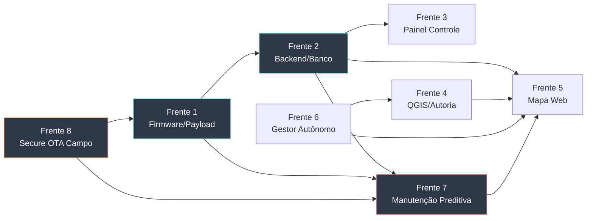

# Caderno de Planejamento e Insights do Projeto Sentinela (`antigravityplan.md`)

> **Finalidade:** Este arquivo centraliza todas as análises, descobertas de bancada/campo, diretrizes de arquitetura e especificações técnicas de maturação do **Projeto Sentinela**. Serve como base de conhecimento e registro oficial para o trabalho integrado das equipes de desenvolvimento.

---

## 1. Diretrizes Invioláveis do Projeto

Todas as propostas, especificações e implementações futuras **devem obedecer rigorosamente** aos seguintes princípios estabelecidos na documentação de base:

1. **Complexidade Ciclomática $\le 10$ ([QUALIDADE_CODIGO.md](file:///Users/matheus/Documents/Claude%20Projects/Sentinela/docs/QUALIDADE_CODIGO.md)):**
   - Nenhuma função em C/C++ ou Python pode ultrapassar $CC = 10$.
   - A complexidade é verificada via `./tools/venv/bin/python tools/complexidade.py --limite 10`.

2. **Falha Explícita e Integridade ([RC-07](file:///Users/matheus/Documents/Claude%20Projects/Sentinela/docs/REQUISITOS.md#L43)):**
   - Sensores ou componentes descalibrados/com defeito devem ser reportados expressamente (ex: tensão de bateria marcada como `nc`).
   - É expressamente proibido mascarar erros com dados fictícios, fallbacks omissos ou try/except genéricos.

3. **Política de Citação e Rastreabilidade ([REFERENCIAS.md](file:///Users/matheus/Documents/Claude%20Projects/Sentinela/docs/REFERENCIAS.md)):**
   - Toda constante, limiar ou afirmação técnica deve possuir tag de proveniência (`[M]`, `[N]`, `[L]`, `[G]`, `[E]`).
   - Afirmações geotécnicas, geológicas ou geográficas **não podem ser marcadas com `[E]`** — exigem respaldo de norma, literatura ou órgão governamental.

4. **Tripla Camada de Responsabilidade Técnica ([RESPONSABILIDADE_TECNICA.md](file:///Users/matheus/Documents/Claude%20Projects/Sentinela/docs/RESPONSABILIDADE_TECNICA.md)):**
   - **Camada 1 (Produto):** Instrumento, firmware e hardware (Mecatrônica / ADS via CRT/CFT).
   - **Camada 2 (Geotecnia/Aplicação):** Laudos de estabilidade de talude, posição de sensores e interpretação geotécnica **exigem Engenheiro Geotécnico ou Geólogo com ART (CREA)**.
   - **Camada 3 (Decisão):** Atribuição exclusiva do Poder Público / Defesa Civil ([RC-00](file:///Users/matheus/Documents/Claude%20Projects/Sentinela/docs/REQUISITOS.md#L15)).

5. **Apoio à Decisão, Nunca Acionamento Autônomo ([RC-00](file:///Users/matheus/Documents/Claude%20Projects/Sentinela/docs/REQUISITOS.md#L15)):**
   - O sistema **não aciona evacuação de forma autônoma** e não substitui julgamento técnico.
   - Todo material, interface, alerta e documentação devem refletir isso explicitamente.

6. **Posicionamento Competitivo Correto ([NEGOCIO.md §4](file:///Users/matheus/Documents/Claude%20Projects/Sentinela/docs/NEGOCIO.md#L39), [CONCORRENCIA.md](file:///Users/matheus/Documents/Claude%20Projects/Sentinela/docs/CONCORRENCIA.md)):**
   - O hardware não é o diferencial; a originalidade defensável está na **referência distribuída**, na **integração geoespacial** e no **custo por ponto**.
   - O Sentinela concorre com o **nada** que existe no talude municipal, não com instrumentação premium de barragem.

---

## 2. Fatos e Descobertas Consolidadas

### 2.1. Hardware e Plataforma de Rádio
- **Placa de Bancada:** Heltec WiFi LoRa 32 V2 (ESP32 + SX1276).
- **Parâmetros Físicos Resolvidos:**
  - Flash real de **4 MB** (Winbond `ef:4016`) fixada no `platformio.ini` ([E-005](file:///Users/matheus/Documents/Claude%20Projects/Sentinela/ERROS.md#L68)).
  - Baudrate máximo confiável no CP2102: **`230400`** ([E-001](file:///Users/matheus/Documents/Claude%20Projects/Sentinela/ERROS.md#L25)).
  - Frequência LoRa P2P em **`916.8 MHz`** / LoRaWAN em **AU915 Sub-banda 2** ([ADR-003](file:///Users/matheus/Documents/Claude%20Projects/Sentinela/docs/ARQUITETURA.md#L82)), respeitando a Resolução Anatel 680/2017 e Ato 14448/2017.
  - Tensão de alimentação de periféricos/display chaveada por `Vext` (GPIO 21), ativo em nível **BAIXO** ([A-004](file:///Users/matheus/Documents/Claude%20Projects/Sentinela/ERROS.md#L273)).
- **Proteção do Amplificador de Potência (PA):**
  - **NUNCA** gravar firmware RF-ativo (`node_dev`, `node_range`) em placas sem antena física ([A-003](file:///Users/matheus/Documents/Claude%20Projects/Sentinela/ERROS.md#L268) / [A-010](file:///Users/matheus/Documents/Claude%20Projects/Sentinela/ERROS.md#L319)).
  - Placas de teste sem antena devem rodar obrigatoriamente o papel passivo `ROLE_BENCH`.
  - Executar sempre `esptool.py flash_id` antes de qualquer gravação para confirmar o endereço MAC ([E-007](file:///Users/matheus/Documents/Claude%20Projects/Sentinela/ERROS.md#L143)).

### 2.2. Enlace e Propagação de Campo
- **Modelo de Atenuação em Encosta Florestada (`[M]` Ensaio 02):**
  $$PL(d) = PL(d_0) + 10 \cdot n \cdot \log_{10}\left(\frac{d}{d_0}\right) + X_\sigma, \quad n = 3,28$$
- **Atenuação sob Tempestade ([REFERENCIAS.md §5.3](file:///Users/matheus/Documents/Claude%20Projects/Sentinela/docs/REFERENCIAS.md#L323)):**
  - Em $900\,\text{MHz}$, a atenuação por gotas de chuva é desprezível ($\approx 0,0002\,\text{dB/200m}$ via ITU-R P.838-3).
  - A perda de margem durante tempestades é provocada pela umidade retida no dossel vegetal e reflexões em superfícies encharcadas (ITU-R P.833-10).
- **Ganho de Antena — Regra Regulatória Resolvida ([CONFORMIDADE.md §1.1.1](file:///Users/matheus/Documents/Claude%20Projects/Sentinela/docs/CONFORMIDADE.md#L44)):**
  - **6 dBi é o ganho de referência.** Acima disso, a potência conduzida deve ser reduzida na mesma proporção — EIRP legal fica constante.
  - **Atalaia:** Manter até 6 dBi omnidirecional (ganho máximo legal de TX).
  - **Farol/Gateway:** Antena acima de 6 dBi vale pela **recepção** (sem penalidade regulatória), alinhado com o SitkaNet (Yagi 9 dBi no hub).

### 2.3. Estabilidade Mecânica e Vento
- **Dimensionamento da Ancoragem ([NBR 6123](file:///Users/matheus/Documents/Claude%20Projects/Sentinela/docs/REFERENCIAS.md#L69)):**
  - Vento característico $V_k = 35,8\,\text{m/s}$ a $1,5\,\text{m}$ de altura para encostas.
  - Hastes elevadas sofrem flexão parasita ($\Delta\theta > 0,27^\circ$), gerando ruído e falsos alarmes de inclinação.
  - **Decisão:** Separar as funções — inclinômetro embaixo (rente ao solo), antena em cima. O nó Atalaia deve ser cravado diretamente no solo (ponteira de aço) ou fixado em tubo galvanizado de $1.1/2"$ ([ANCORAGEM.md §2](file:///Users/matheus/Documents/Claude%20Projects/Sentinela/docs/ANCORAGEM.md#L76)).

### 2.4. Sensoriamento — Premissas Fundamentais
- **Encosta avisa com deslocamento lento, não com vibração** ([SENSORES.md](file:///Users/matheus/Documents/Claude%20Projects/Sentinela/docs/SENSORES.md)):
  - Acelerômetro usado como **inclinômetro** (vetor gravidade), não como detector de vibração.
  - Sismo regional não é objetivo do sistema — sismicidade brasileira é baixa e MEMS de baixo custo não detecta.
- **Preditor de maior peso: chuva acumulada** — curva de Tatizana et al. (1987) **[L]**.
- **Compensação térmica obrigatória:** MEMS apresenta deriva com temperatura; ciclo térmico diário é a principal fonte de falso positivo esperada **[E]**.
- **Confirmação cruzada ([RC-09](file:///Users/matheus/Documents/Claude%20Projects/Sentinela/docs/REQUISITOS.md#L52)):** Alerta de movimento exige persistência temporal e correlação com chuva ou nó vizinho.

---

## 3. Especificações e Maturação das Próximas Implementações

### Frente 1: Firmware e Estrutura de Payload (`firmware/`)

#### A. Estruturação da Camada Protocolo (`lib/proto/`)
- **Meta:** Definir a codificação de payload binário ultracompacto ($\le 20\,\text{bytes}$) para transmissão em LoRa P2P e LoRaWAN.
- **Campos Propostos (Payload de Sensor):**
  1. `node_id` (uint16_t, 2B): Identificador único da Atalaia.
  2. `seq_num` (uint16_t, 2B): Contador de sequência de pacotes.
  3. `timestamp` (uint32_t, 4B): Epoch UNIX das medições.
  4. `chuva_acum_1h` (uint16_t, 2B): Pluviometria acumulada na última hora ($0,1\,\text{mm}$/lsb).
  5. `inclinacao_pitch_roll` (int16_t x 2, 4B): Ângulos de inclinação ($0,01^\circ$/lsb).
  6. `umidade_solo` (uint16_t, 2B): Saturação da camada superficial.
  7. `bateria_mv` (uint16_t, 2B): Tensão de alimentação em millivolts.
  8. `status_flags` (uint8_t, 1B): Indicadores de integridade, watchdog e alarme de vedação.
- **Portabilidade:** Código C++ puro, compilável no host para testes unitários automatizados.

> [!IMPORTANT]
> **Insight de Análise Cruzada:** O payload acima **não inclui os campos de telemetria de saúde** exigidos por [RC-12](file:///Users/matheus/Documents/Claude%20Projects/Sentinela/docs/REQUISITOS.md#L72) e detalhados em [MANUTENCAO.md §8](file:///Users/matheus/Documents/Claude%20Projects/Sentinela/docs/MANUTENCAO.md#L264). É necessário definir um **segundo tipo de payload — pacote de saúde** — com frequência menor (1x/dia), contendo: `E_dia`, `t_ini`, `t_fim`, `I_pico`, `V_min`, `DoD`, `V_fim`, `temperatura_interna`, `umidade_interna`, `reinicios`, `watchdogs`, `heap_livre`, `sensores_validos` (bitmap) e `versao_firmware`. Esses campos alimentam a Frente 7.

#### B. Desmembramento da HAL (`lib/hal/`) e Alvo STM32WLE5
- Manter a divisão rígida descrita em [ADR-004](file:///Users/matheus/Documents/Claude%20Projects/Sentinela/docs/ARQUITETURA.md#L100):
  - `lib/app/`: Máquina de estados e limiares de alerta. **Zero código de chip ou `#include <Arduino.h>`**.
  - `lib/hal/esp32/`: Implementação atual de bancada no ESP32.
  - `lib/hal/stm32wl/`: Implementação futura para o nó definitivo **RAK3172 (STM32WLE5)** com consumo de standby de $\sim 1,6\,\mu\text{A}$.

#### C. Autonomia de Decisão Local ([ADR-006](file:///Users/matheus/Documents/Claude%20Projects/Sentinela/docs/ARQUITETURA.md#L150) / [RC-05](file:///Users/matheus/Documents/Claude%20Projects/Sentinela/docs/REQUISITOS.md#L37))
- **A regra crítica de alerta é avaliada no próprio nó**, não no servidor.
- Limiares parametrizáveis por downlink, com valores padrão persistidos em NVS ([RC-06](file:///Users/matheus/Documents/Claude%20Projects/Sentinela/docs/REQUISITOS.md#L40)).
- Consequência: o nó continua útil com o gateway fora do ar — exatamente o cenário de evento extremo.

#### D. Persistência de Estado ([RC-06](file:///Users/matheus/Documents/Claude%20Projects/Sentinela/docs/REQUISITOS.md#L40) / [RC-13](file:///Users/matheus/Documents/Claude%20Projects/Sentinela/docs/REQUISITOS.md#L77))
- Acumulados de chuva (24h/72h) e referência de calibração sobrevivem a reinício (NVS).
- Histórico local de **30 dias** de resumo diário de energia persiste em NVS, para reconstruir tendência após período sem enlace.

#### E. Autenticação de Payload ([RC-11](file:///Users/matheus/Documents/Claude%20Projects/Sentinela/docs/REQUISITOS.md#L61))

> [!WARNING]
> **Lacuna identificada:** O protocolo P2P da fase 0-1 deve **reservar espaço** para autenticação desde o início, mesmo que ainda não implementada. Em LoRaWAN (fase 4+), AES-128 com contador anti-replay vem da spec. No P2P, a injeção de alerta falso é ameaça concreta — especialmente em sistema de alerta de risco à vida.

---

### Frente 2: Backend, Ingestão e Modelagem GIS (`backend/`)

#### A. Ingestor e Séries Temporais (TimescaleDB)
- **Status Atual:** `backend/ingestor.py` insere registros de telemetria brutos recebidos do broker Mosquitto MQTT no PostgreSQL/TimescaleDB.
- **O que o esquema.sql já tem:** Tabelas `enlace`, `saude_bridge`, `ponto_ensaio`, view `enlace_analise` e aggregated view contínua `enlace_hora`.
- **Maturação Necessária:**
  - Criação de **tabela de leitura de sensor** (ainda inexistente — o esquema atual é explicitamente de enlace, não de sensor). Campos: `node_id`, `recebido_em`, `chuva_acum_1h`, `chuva_acum_24h`, `chuva_acum_72h`, `inclinacao_pitch`, `inclinacao_roll`, `umidade_solo`, `bateria_mv`, `status_flags`.
  - Criação de **tabela de saúde da Atalaia** para dados do pacote diário de energia (RC-12): `E_dia`, `V_min`, `DoD`, janelas, bitmap de sensores válidos.
  - Criação de agregadores contínuos (*Continuous Aggregates*) no TimescaleDB para janelas móveis de chuva acumulada de 1h, 24h e 72h.
  - Implementação de **tabela de eventos de alarme** com idempotência rigorosa contra reconexões do gateway/bridge, vinculando cada alarme ao dado bruto que o originou ([RC-10](file:///Users/matheus/Documents/Claude%20Projects/Sentinela/docs/REQUISITOS.md#L57) — rastreabilidade).

> [!IMPORTANT]
> **Insight de Análise Cruzada — Esquema SQL vs. Plano:** O `esquema.sql` atual é exclusivamente de **enlace de rádio** (RSSI, SNR, perda). Não existe nenhuma tabela para dados de sensor (chuva, inclinação, umidade) nem para alarmes. A Frente 2 precisa criar essas tabelas **antes** da Frente 1 entregar payload de sensor, para evitar que dados de campo evaporem. Sugere-se versionar as migrações com arquivos numerados (`001_enlace.sql`, `002_sensor.sql`, `003_alarmes.sql`, `004_saude_atalaia.sql`).

#### B. Cruzamento Geoespacial (PostGIS)
- **Modelagem de Dados Espaciais:**
  - Tabela de **Atalaias** (`geom`: Ponto 3D - WGS84 / SIRGAS 2000) — a tabela `no` já existe com coluna `posicao GEOGRAPHY(POINT, 4326)`.
  - Tabela de **Cartas de Suscetibilidade** (`geom`: Polígono de áreas de alto/muito alto risco) — **nova**.
  - Tabela de **População/Moradias Expostas** (`geom`: Polígono/Ponto) — **nova**.
- **Função de Risco Automatizado:**
  - Consulta PostGIS que, ao atingir limiar de precipitação ou inclinação em um nó, correlaciona dinamicamente a área afetada com a estimativa de edificações e população exposta na mancha geográfica correspondente.
  - **Conexão com GEOPIXEL.md §4.2:** Esta função se integra ao Módulo de Vistoria existente na plataforma Geopixel — sensor prioriza qual talude inspecionar; vistoria rotula o que o sensor mediu.

#### C. Ingestão de Dados de Terceiros ([NEGOCIO.md §4](file:///Users/matheus/Documents/Claude%20Projects/Sentinela/docs/NEGOCIO.md#L60))

> [!TIP]
> **Insight Estratégico:** O NEGOCIO.md determina que o sistema deve **ingerir dados de instrumentos de terceiros**. Cliente que já tem Worldsensing ou Senceive instalado não deve ser obrigado a substituir. Isso reforça a decisão de padrões abertos (ADR-005) e impacta o esquema: a tabela de leitura de sensor deve ter um campo `fonte` (própria/terceiro) e aceitar formatos padronizados (OGC SensorThings API, CSV/KML). Essa capacidade transforma concorrente em complemento.

---

### Frente 3: Painel de Controle e Diagnóstico (`tools/painel/`)

#### A. Monitoramento de Rede LoRa em Tempo Real
- Manter a visualização do painel em `http://localhost:8765` assinando os tópicos MQTT do Mosquitto.
- Exibir métricas de qualidade de enlace: RSSI local/remoto, SNR, margem de desvanecimento, assimetria de link e taxa de pacotes perdidos por salto de sequência.

#### B. Gestão de Qualidade e Conformidade
- Manter a integração dinâmica com `tools/complexidade.py` para listar em tempo real o nível de complexidade ciclomática de todas as funções do projeto.
- Exibir o painel de pendências e de saúde de documentação integrando a política de proveniência de dados.

#### C. Expansão para Dados de Sensor

> [!NOTE]
> **Dependência:** A aba de monitoramento de sensor no painel depende da Frente 1 (payload de sensor) e da Frente 2 (tabela de leitura). Atualmente, o painel exibe apenas dados de enlace. A nova aba `#/sensor` deve mostrar:
> - Chuva acumulada instantânea (1h/24h/72h) com barras visuais.
> - Inclinação com indicador gráfico de vetor.
> - Umidade do solo com gradiente por profundidade.
> - Timestamp da última leitura com alerta se ultrapassar 3x o heartbeat ([RC-02](file:///Users/matheus/Documents/Claude%20Projects/Sentinela/docs/REQUISITOS.md#L25)).

---

### Frente 4: Visualização Geoespacial — Ferramentas de Autoria (`tools/georreferenciar.py`, `docs/qgis/`)

#### A. Estrutura de Armazenamento Exclusiva por Atalaia no Servidor
- **Organização em Disco no Homeserver:**
  - Diretório raiz no servidor: `/DATA/Media/Sentinela/Atalaias/{node_id}/` (ex: `/DATA/Media/Sentinela/Atalaias/ATL-CGB-014/`).

> [!TIP]
> **Insight de Nomenclatura:** A convenção de identificação está definida em [MANUTENCAO.md §1](file:///Users/matheus/Documents/Claude%20Projects/Sentinela/docs/MANUTENCAO.md#L12): `ATL-<município>-<sequencial>` (ex: `ATL-CGB-014`). O Farol correspondente: `FAR-CGB-01`. As pastas e referências devem adotar essa convenção, não IDs genéricos como "AT-01".

  - Cada Atalaia possui uma pasta exclusiva contendo:
    - `fotos/`: Fotos de instalação e vistorias com metadados EXIF.
    - `dados/`: Histórico exportado e logs do dispositivo.
    - `documentos/`: Ficha técnica de instalação, registro de ancoragem e notas de campo.
    - `manutencao/`: Registro de visitas, intervenções realizadas e fotos de manutenção — alimenta o ciclo vistoria↔sensor descrito em [GEOPIXEL.md §4.2](file:///Users/matheus/Documents/Claude%20Projects/Sentinela/docs/GEOPIXEL.md#L98).

- **Fluxo de Geolocalização por EXIF:**
  1. A foto tirada no momento da fixação é salva na pasta da Atalaia.
  2. O script [tools/georreferenciar.py](file:///Users/matheus/Documents/Claude%20Projects/Sentinela/tools/georreferenciar.py) extrai `GPSLatitude`, `GPSLongitude`, `GPSAltitude` e `DateTimeOriginal`.
  3. O PostGIS registra o ponto espacial e o caminho relativo da imagem, tornando-a acessível via popup de atributos no QGIS.

#### B. Fontes de Imagens de Satélite Selecionadas (Foco em Municípios Brasileiros e Serra do Mar)
- **CBERS-4A / Amazonia-1 (INPE / Governamental `[G]`):**
  - **Prioridade Máxima:** Imagens gratuitas do programa espacial brasileiro desenvolvidas especificamente para o território nacional.
  - **Resolução:** Até $2\,\text{m}$ (Câmera WPM do CBERS-4A).
  - **Uso:** Gratuito e ilimitado para desenvolvimento e implantação municipal sem custos de licença comercial.
- **Sentinel-2 (Copernicus / ESA):**
  - **Frequência:** Revisitamento a cada 5 dias ($10\,\text{m}$ de resolução).
  - **Multiespectral:** Bandas NIR/SWIR essenciais para monitoramento de saturação de água em solo e umidade em encostas florestadas da Serra do Mar.
  - **Licença:** Gratuita CC BY 4.0.
- **ESRI World Imagery / Google Satellite:**
  - Base ortofotográfica contínua em alta resolução ($0,5\,\text{m}$) integrada via tiles XYZ no QGIS para fundo de contexto urbano.

#### C. Altimetria e Relevo de Encosta Escolhido: FABDEM
- **Modelo Adotado: FABDEM (Forest And Buildings removed Copernicus DEM - 30m):**
  - **Justificativa:** Em áreas de mata atlântica densa (Serra do Mar), os modelos de elevação tradicionais (como SRTM ou Copernicus DEM puro) medem o topo da copa das árvores. O FABDEM aplica algoritmos avançados para remover a vegetação e edificações, entregando o **relevo real do solo (*bare-earth*)**.
  - **Produtos Gerados no QGIS:** Curvas de nível (isolinhas de $5\,\text{m}$ e $10\,\text{m}$), mapa de sombreamento de relevo (*Hillshade*) e declividade do talude (*Slope*).

#### D. Simbologia e Cores Aprovadas no QGIS
- Alinhamento total com a identidade visual do painel de controle do Sentinela:
  - **Verde (`#00FF00`):** `APROVADO` / Operação Normal.
  - **Amarelo (`#FFFF00`):** `LIMITE` / Limiar de Atenção.
  - **Vermelho (`#FF0000`):** `REPROVADO` / Alerta Crítico de Risco.
  - **Cinza (`#888888`):** `COLETANDO` / Sem Sinal (Nó Silencioso / Heartbeat pendente).

> [!TIP]
> **Insight de Análise Cruzada — Alinhamento com MANUTENCAO.md:** Considerar adotar as **quatro severidades de alarme** definidas em [MANUTENCAO.md §5](file:///Users/matheus/Documents/Claude%20Projects/Sentinela/docs/MANUTENCAO.md#L152) como extensão da simbologia: CRÍTICO (vermelho pulsante), URGENTE (vermelho estático), ATENÇÃO (amarelo), INFO (verde). Isso traz consistência entre o painel, o QGIS e o catálogo de alarmes do backend.

#### E. Conexão Dinâmica e Atualização ao Vivo no QGIS
- Conexão PostgreSQL/PostGIS habilitada no QGIS (no Mac e no Homeserver).
- Recurso de **Auto-refresh** configurado na camada de Atalaias (atualização automática a cada 10 segundos), refletindo instantaneamente mudanças de status ou acumulados de chuva no mapa do QGIS.

---

### Frente 5: Centralização Cartográfica no Painel Web (`http://localhost:8765/#/mapa`)

#### A. Avaliação de Viabilidade e Papéis do Sistema
- **QGIS como Ferramenta de Autoria e Geoprocessamento (Equipe Técnica):**
  - Utilizado pelos especialistas em geoprocessamento para tratar imagens, delimitar manchas de risco, gerar curvas de nível isolinhas a partir do FABDEM e carregar camadas no PostGIS.
- **Painel do Sentinela como Centro de Comando Integrado (Operador / Defesa Civil):**
  - **Objetivo:** O operador da Defesa Civil acessa o mapa interativo da cidade diretamente no próprio painel web (`http://localhost:8765/#/mapa`).
  - **Eliminação de Dependência de Softwares de Terceiros:** Não é necessário instalar o QGIS ou qualquer programa proprietário nos computadores dos operadores — basta abrir o navegador web em qualquer desktop, tablet ou smartphone.

#### B. Arquitetura Frontend Leve e Autônoma (Leaflet.js)
- **Biblioteca Adotada: Leaflet.js** (versão minificada `~40 KB` hospedada localmente em `tools/painel/static/vendor/leaflet/`).
- **Aderência às Diretrizes:** Zero dependências de frameworks pesados no servidor (Python stdlib pura em `tools/painel/servidor.py`), mantendo $CC \le 10$ e consumo mínimo de recursos.
- **Resiliência Offline:** O servidor pode armazenar cache de tiles de satélite e vetores no homeserver (`/DATA/Tiles/`), garantindo que o mapa continue operando no painel mesmo com a internet interrompida durante tempestades extremas.

> [!IMPORTANT]
> **Insight Crítico — Resiliência em Tempestade:** Este é o cenário de design mais importante do sistema. Durante o evento extremo (quando o sistema é mais necessário), a infraestrutura de internet tende a falhar. O cache local de tiles (`/DATA/Tiles/`) e a capacidade de operar completamente offline são **requisitos de confiabilidade**, não conveniência. O gestor autônomo (Frente 6) deve manter esse cache atualizado diariamente, e o frontend deve degradar graciosamente quando os tiles online estiverem indisponíveis.

#### C. Estrutura de Camadas Sobrepostas no Mapa do Painel
1. **Camada 1 — Fundo de Satélite & Basemaps Raster:**
   - Alternador dinâmico: Satélite Sentinel-2 / CBERS-4A / ESRI World Imagery vs. Fundo Escuro (*CartoDB Dark Matter*) integrado à estética do painel.
2. **Camada 2 — Altimetria e Relevo (FABDEM):**
   - Curvas de nível (isolinhas de $5\,\text{m}$ em $5\,\text{m}$) exportadas via QGIS em GeoJSON leve e renderizadas nativamente pelo mapa web.
3. **Camada 3 — Áreas de Risco Geológico e População Exposta:**
   - Polígonos de suscetibilidade da Defesa Civil/CEMADEN servidos via API `/api/gis/suscetibilidade`.
   - Tooltips com contagem aproximada de moradias e população exposta ao passar o mouse.
4. **Camada 4 — Atalaias e Telemetria em Tempo Real:**
   - Marcadores com pulsos animados coloridos conforme o status: Verde (`APROVADO`), Amarelo (`LIMITE`), Vermelho (`REPROVADO`), Cinza (`COLETANDO` / Sem Sinal).
   - **Modal Interativo da Atalaia:** Ao clicar na Atalaia, exibe foto oficial de instalação da pasta exclusiva (`/DATA/Media/Sentinela/Atalaias/{node_id}/fotos/`), tensão de bateria, chuva acumulada de 24h/72h, inclinação e margem de rádio em dB.
5. **Camada 5 — Rota de Manutenção (Frente 7):**
   - Traçado da rota otimizada de visita a Atalaias sinalizadas, derivada da roteirização geoespacial do PostGIS.
   - Visível apenas quando há alarmes de manutenção ativos.

#### D. Especificação das Rotas da API REST do Servidor (`tools/painel/servidor.py`)
- `/api/gis/atalaias`: Retorna a coleção GeoJSON contendo a posição de todas as Atalaias ativas, metadados da pasta de mídia e status instantâneo.
- `/api/gis/suscetibilidade`: Retorna a camada vetorial GeoJSON de zonas de risco de deslizamento cadastradas no PostGIS.
- `/api/gis/rotas-manutencao`: Retorna a rota otimizada de manutenção (Frente 7) quando há alarmes ativos.
- Todas as funções auxiliares mantêm **$CC \le 10$** via refatorações modulares.

> [!NOTE]
> **Insight de Integração Geopixel:** O painel web do Sentinela deve publicar dados em formatos compatíveis com a plataforma Geopixel Monitor existente (CSV, KML, OGC SensorThings API). A integração com o TerraMA² (INPE), já parceiro da Geopixel, é ponto natural de entrada — evitando integração proprietária ([GEOPIXEL.md §4.5](file:///Users/matheus/Documents/Claude%20Projects/Sentinela/docs/GEOPIXEL.md#L126)).

---

### Frente 6: Gestor Autônomo de Ingestão de Dados e Insumos Geoespaciais (`tools/gestor_autonomo.py` / `sentinela-gestor.service`)

#### A. Escopo de Automação do Servidor (O que automatizar vs. O que manter manual)
> [!IMPORTANT]
> **Fronteira Clara de Segurança:** O sistema gestor autônomo automatiza exclusivamente a **ingestão e atualização de DADOS e INSUMOS** (mapas, fotos, boletins de risco, séries temporais e cache de tiles). Atualizações de **Software, Pacotes de Sistema Operacional, Python Venv ou Firmware** ficam estritamente **sob controle manual da equipe de TI e Desenvolvimento**, prevenindo incompatibilidades ou quebras inesperadas no ambiente de produção.

- **Processos 100% Automatizados (Execução Diária/Segundo Plano no Homeserver):**
  1. **Varredura e Ingestão de Fotos de Campo por Atalaia:**
     - Monitoramento automático dos diretórios `/DATA/Media/Sentinela/Atalaias/{node_id}/fotos/`.
     - Ao detectar uma nova foto adicionada pela equipe de instalação, o gestor executa automaticamente o script `tools/georreferenciar.py`, lê os metadados EXIF (GPS/Data) e atualiza o registro espacial da Atalaia no PostGIS sem intervenção manual.
  2. **Verificação e Ingestão de Imagens de Satélite Recentes (Sentinel-2 / INPE):**
     - Verificação diária via STAC / APIs públicas (ESA / INPE) por novas passagens de satélite com cobertura de nuvens $\le 20\%$ na delimitação geográfica do município.
     - Atualização automática dos tiles do basemap de satélite do painel.
  3. **Atualização de Boletins e Alertas Governamentais (`[G]`):**
     - Sincronização automática diária com feeds/APIs abertas do CEMADEN, INMET e CPRM/SGB para incorporar polígonos de alerta pluviométrico e manchas de risco geológico atualizadas.
  4. **Manutenção e Pré-geração do Cache de Tiles Offline (`/DATA/Tiles/`):**
     - Regeneração periódica do cache local de mapas para garantir funcionamento contínuo do painel web caso ocorra interrupção de conexão de internet durante tempestades na Serra do Mar.
  5. **Gestão e Compressão de Séries Temporais no TimescaleDB:**
     - Manutenção automática das políticas de agregação contínua (1h, 24h, 72h) e retenção inteligente de telemetria bruta no PostgreSQL.

#### B. Arquitetura do Serviço e Supervisão
- **Serviço de Usuário no Systemd:** `sentinela-gestor.service` e `sentinela-gestor.timer` (executado diariamente às 03:00 no homeserver).
- **Módulo Principal:** `tools/gestor_autonomo.py` escrito em Python puro (stdlib + urllib/json), respeitando o teto de **Complexidade Ciclomática $CC \le 10$** por função (`varre_fotos_atalaias()`, `checa_satelite_sentinel()`, `sincroniza_alertas_cemaden()`, `atualiza_cache_tiles()`).
- **Tratamento de Falha Gracioso ([RC-07](file:///Users/matheus/Documents/Claude%20Projects/Sentinela/docs/REQUISITOS.md#L43)):** Se uma API externa (ESA/INPE/CEMADEN) estiver indisponível ou offline, o gestor registra o evento no log do sistema (`journalctl --user -u sentinela-gestor`) e preserva os insumos locais vigentes sem interromper o painel web ou os dados de telemetria.

---

### Frente 7: Manutenção Preditiva e Saúde da Frota (NOVA)

> [!IMPORTANT]
> **Insight de Análise Cruzada:** Esta frente estava **implícita** nas Frentes 1 e 2 mas nunca foi especificada como frente própria. O [MANUTENCAO.md](file:///Users/matheus/Documents/Claude%20Projects/Sentinela/docs/MANUTENCAO.md) é um dos documentos mais detalhados do projeto e contém o candidato mais forte à patente ([PATENTES.md §3 — Candidato A](file:///Users/matheus/Documents/Claude%20Projects/Sentinela/docs/PATENTES.md#L56)). O valor que ele descreve — manutenção por condição em vez de calendário — é **o que viabiliza a operação em escala** (50+ Atalaias em encostas de difícil acesso). Merece frente própria com especificação detalhada.

#### A. Referência Distribuída — A Rede como Sensor de Referência ([MANUTENCAO.md §4](file:///Users/matheus/Documents/Claude%20Projects/Sentinela/docs/MANUTENCAO.md#L109))
- **Princípio:** Cada Atalaia é comparada com a mediana das vizinhas do mesmo Farol:
  ```
  razao_i = E_dia(Atalaia_i) / mediana(E_dia de todas as Atalaias do Farol)
  ```
- Se **todas** caem juntas → tempo nublado, não é falha.
- Se **uma** cai e as outras não → problema local: sujeira, sombra ou hardware.
- **Vantagens:** Elimina variável climática sem instrumento adicional; custo marginal zero; melhora conforme a rede cresce.
- **Propriedade Intelectual:** Candidato a reivindicação de patente. **Não divulgar antes de consultar o INPI** ([PATENTES.md §5](file:///Users/matheus/Documents/Claude%20Projects/Sentinela/docs/PATENTES.md)).

> [!CAUTION]
> **Risco de PI:** A divulgação pública (incluindo repositório público no GitHub, apresentação à Geopixel ou publicação) **antes do depósito de patente compromete a novidade** ([NEGOCIO.md §Alerta Transversal](file:///Users/matheus/Documents/Claude%20Projects/Sentinela/docs/NEGOCIO.md#L82)). O repositório deve permanecer **privado** até que PT-01 (busca de anterioridade) e PT-03 (titularidade) sejam resolvidos.

#### B. Assinaturas de Falha — Diagnóstico pela Curva Solar ([MANUTENCAO.md §3](file:///Users/matheus/Documents/Claude%20Projects/Sentinela/docs/MANUTENCAO.md#L55))
- **Grandezas registradas por dia:** `E_dia`, `t_ini`/`t_fim`, `I_pico`, `V_min`, `DoD`, `V_fim`.
- **Padrões e diagnósticos:**

  | Padrão | Diagnóstico | Ação |
  |---|---|---|
  | `E_dia` cai gradualmente, janela inalterada | Sujeira no painel | Limpeza |
  | Janela encurta progressivamente | Vegetação crescendo e sombreando | Poda |
  | `E_dia` cai abruptamente para ~0 | Painel desconectado/danificado | Visita urgente |
  | `E_dia` normal mas `V_min` cai a cada noite | Bateria degradando | Trocar bateria |
  | `DoD` aumenta sem mudança em `E_dia` | Consumo anômalo (sensor travado, rádio preso) | Diagnóstico remoto |

- **Maturidade:** Assinaturas derivadas de princípio físico e literatura fotovoltaica, **ainda não validadas em campo** **[E]**. Limiares numéricos (0,75 de razão, 7 dias, 14 dias) são pontos de partida e **precisam ser calibrados com operação real** antes de virarem gatilho automático ([RC-18](file:///Users/matheus/Documents/Claude%20Projects/Sentinela/docs/REQUISITOS.md#L97)).

#### C. Catálogo de Alarmes ([MANUTENCAO.md §5](file:///Users/matheus/Documents/Claude%20Projects/Sentinela/docs/MANUTENCAO.md#L152))
- **Quatro severidades:** CRÍTICO, URGENTE, ATENÇÃO, INFO — cada uma com gatilho e ação definida.
- **Regra de ouro:** Alarme sem ação definida vira ruído; ruído faz a equipe ignorar o painel ([RC-15](file:///Users/matheus/Documents/Claude%20Projects/Sentinela/docs/REQUISITOS.md#L85)).
- **Implementação no backend:** O ingestor avalia os pacotes de saúde diários e gera eventos na tabela de alarmes.
- **Alarme com melhor retorno:** Umidade interna do invólucro ([RC-14](file:///Users/matheus/Documents/Claude%20Projects/Sentinela/docs/REQUISITOS.md#L81)) — detecta falha de vedação **antes** da água destruir a eletrônica.

#### D. Índice de Saúde da Atalaia ([MANUTENCAO.md §6](file:///Users/matheus/Documents/Claude%20Projects/Sentinela/docs/MANUTENCAO.md#L223))
- Número de 0 a 100 para priorizar rota de manutenção.
- **Pesos:** Comunicação (30%), Energia (30%), Sensores (25%), Integridade (15%).
- **Faixas:** 90–100 saudável · 70–89 observar · 50–69 agendar · <50 intervir.
- **Regra crítica ([RC-16](file:///Users/matheus/Documents/Claude%20Projects/Sentinela/docs/REQUISITOS.md#L89)):** Qualquer alarme CRÍTICO **zera o índice**, independentemente do restante. Atalaia muda com bateria cheia = inútil.

#### E. Roteirização Geoespacial da Manutenção ([MANUTENCAO.md §7](file:///Users/matheus/Documents/Claude%20Projects/Sentinela/docs/MANUTENCAO.md#L244))
- **Problema:** Custo de operação é dominado por deslocamento, não pela intervenção.
- **Saída:** Rota otimizada (PostGIS) com Atalaias ordenadas por proximidade + prioridade.
- **Regra operacional:** Visita por degradação lenta deve **arrastar** intervenções de baixa prioridade nas Atalaias próximas — trocar bateria que ainda tem 2 meses custa quase nada se a equipe já está a 30 metros.
- **Integração com Painel:** Camada 5 do mapa (Frente 5.C) exibe a rota de manutenção.

#### F. Cronograma de Maturação da Frente 7

| Item | Fase | Depende de |
|---|---|---|
| Telemetria de saúde no payload | 1 | `lib/proto/` |
| Agregação diária de energia em NVS | 1 | — |
| Sensor de umidade interna ao invólucro | 1 | Escolha do invólucro |
| Detecção de sensor travado e fora de faixa | 1 | — |
| Catálogo de alarmes no ingestor | 2 | Backend |
| Referência distribuída entre Atalaias | 3 | Vários dispositivos operando |
| Índice de saúde e painel de frota | 3 | Backend |
| Roteirização geoespacial | 3 | PostGIS |
| Validação das assinaturas em campo | 5 | Operação real |

---

### Frente 8: Atualização de Firmware em Campo (Secure OTA & Manutenção Prática sem Deslacrar)

#### A. Desafio Operacional e Premissa de Campo
- **Inviolabilidade Física e Estanqueidade:** A Atalaia opera instalada em encostas críticas sob chuva, umidade relativa extrema e intempéries da Serra do Mar. Seu invólucro é **hermeticamente selado (IP67/IP68)**.
- **Dificuldade de Manutenção Física:** Abrir o gabinete em campo exige remoção de selagem, ferramentas manuais, trabalho em altura ou acesso por corda (NR-35), além de expor a placa eletrônica a pingos de chuva e umidade durante a manutenção.
- **Decisão de Arquitetura:** O firmware deve permitir **atualização sem fio (Over-The-Air - OTA) em campo**, mantendo a caixa 100% selada, com **requisito mandatório de segurança criptográfica** para impedir injeção de firmware invasor ou travamento (*bricking*) do nó.

#### B. Arquitetura Dual-Target (ESP32 de Bancada vs. STM32WLE5 de Campo)

O projeto adota duas plataformas com tecnologias sem fio distintas ([ADR-004](file:///Users/matheus/Documents/Claude%20Projects/Sentinela/docs/ARQUITETURA.md#L100)):

1. **Plataforma de Bancada/Desenvolvimento (ESP32 — Heltec V2):**
   - **Recursos Nativos:** Possui Wi-Fi (802.11 b/g/n) e Bluetooth 4.2 / BLE integrados.
   - **Modo Primário de Campo (BLE):** Atualização via Bluetooth Low Energy (BLE) com **LE Secure Connections**.
   - **Modo Secundário de Campo (Wi-Fi AP):** Ponto de Acesso temporário WPA2/WPA3 ativado sob demanda via chaveiro magnético (Reed Switch) ou comando assinado via LoRa. Desativa-se automaticamente após 5 minutos de inatividade.

2. **Plataforma Definitiva de Campo (RAK3172 / STM32WLE5 — ADR-004):**
   - **Recursos Nativos:** Microcontrolador ultra-low-power ($1,6\,\mu\text{A}$ standby) com rádio LoRa/LoRaWAN exclusivo. **NÃO possui Wi-Fi nem Bluetooth nativos**.
   - **Canal Sem Fio Primário (LoRaWAN FUOTA):** Firmware Update Over-The-Air via especificação oficial da LoRa Alliance (TR-005). Utiliza transmissão em **Multicast Classe C** e protocolo de transporte de blocos fragmentados (*Fragmented Data Block Transport*).
   - **Canal Sem Fio Secundário (LoRa P2P Direto):** Transmissão local de alta velocidade via canal de serviço LoRa P2P a partir de um dispositivo portátil de manutenção do operador ("Farol Portátil").
   - **Interface de Backup Físico Sem Abertura de Gabinete:** Acoplamento por Pogo-Pins magnéticos externos selados IP68 (UART/SWD) ou porta óptica serial infravermelha (IrDA), mantendo a vedação hermética da caixa principal.

#### C. Matriz de Segurança e Proteção Anti-Invasão (Mandatório)

Conforme diretriz do projeto, **nenhuma atualização OTA é aceita sem verificação criptográfica estrita**. A arquitetura de segurança é estruturada em 5 camadas:

```
[ Build Server (Offline) ]  ---> Assina .bin com Chave Privada (ECDSA P-256)
                                               |
                                     (Transferência Sem Fio)
                                               |
[ Atalaia (Nó de Campo) ]   ---> 1. Valida Pareamento BLE (LE Secure Connections) / Frame Key LoRa
                            ---> 2. Recebe blocos na Partição Staging (ota_1)
                            ---> 3. Calcula Hash SHA-256 dos blocos
                            ---> 4. Valida Assinatura Digital ECDSA via Chave Pública (eFuse OTP)
                            ---> 5. Bootloader alterna boot & dispara Auto-Teste
                            ---> 6. Se falhar: Automatic Rollback para ota_0
```

1. **Assinatura Digital Assimétrica (ECDSA P-256 / Ed25519):**
   - O arquivo binário é assinado no ambiente de build utilizando a **Chave Privada** do desenvolvedor.
   - O nó armazena a **Chave Pública** gravada em memória imutável (eFuse OTP ou partição de boot protegida).
   - O nó verifica a assinatura digital da imagem completa **antes** de autorizar a troca de boot. Firmware sem assinatura válida é descartado imediatamente.

2. **Integridade de Imagem (SHA-256 Checksum):**
   - Cada bloco recebido é validado por CRC32 individual.
   - A imagem completa gravada na partição de *staging* é submetida a um hash SHA-256 completo comparado com o manifesto assinado.

3. **Segurança de Transporte (BLE & LoRa):**
   - **BLE (ESP32):** Conexão obrigatoriamente configurada com **LE Secure Connections com MITM Protection** (ECDH P-256 com Numeric Comparison ou Passkey dinâmica). Pareamento "Just Works" é **estritamente proibido**.
   - **LoRa P2P / FUOTA:** Sessão criptografada com chave de sessão temporária derivativa (AES-128-GCM ou Chacha20-Poly1305) e contador anti-replay.

4. **Proteção contra Bricking e Rollback Automático (Dual-Partition Bootloader):**
   - O dispositivo mantém duas partições de aplicação: `ota_0` (ativa) e `ota_1` (staging).
   - O firmware recebido é gravado na partição inativa sem tocar no firmware em execução.
   - Após validação de assinatura e hash, a flag de boot é alterada para `PENDING_VERIFY`.
   - No primeiro boot da imagem nova, o firmware executa um **auto-teste de integridade** (checagem de sensores, NVS e rádio). Se o auto-teste passar, a partição é confirmada como `VALID`. Se ocorrer crash, falha ou estouro de Watchdog, o bootloader intercepta e **executa o rollback automático para a partição anterior íntegra**.

5. **Fundamentos de Hardware (Secure Boot & Flash Encryption):**
   - **ESP32:** Ativação do **Secure Boot V2** (validação de bootloader pelo hardware) e **Flash Encryption** (AES-XTS das partições em flash via eFuse).
   - **STM32WLE5:** Ativação do **SBSFU (Secure Boot and Secure Firmware Update)** da ST Microelectronics com proteção de leitura de memória RDP Level 1/2.

#### D. Fluxos Operacionais do Técnico em Campo

1. **Fluxo A — Atualização por Smartphone / Tablet (ESP32 via BLE/Wi-Fi):**
   - Técnico aproxima-se do talude com smartphone operando o app oficial do Sentinela.
   - Ativação do rádio local via sensor magnético (Reed Switch) na Atalaia.
   - O app estabelece enlace BLE seguro (Numeric Comparison na tela/app).
   - O app carrega o arquivo de firmware assinado e transmite em blocos com barra de progresso.
   - Concluído em $\sim 45\,\text{segundos}$. O nó reinicia, valida a imagem e emite bipe/LED de confirmação.

2. **Fluxo B — Atualização por Farol Portátil de Manutenção (STM32WLE5 via LoRa P2P):**
   - Técnico utiliza um transceptor portátil de campo (baseado no hardware Farol).
   - Estabelece enlace LoRa P2P em canal dedicado de manutenção.
   - O Farol Portátil envia o pacote fragmentado com retransmissão seletiva (*ACK bitmap*).
   - Permite atualizar o nó a até $100\,\text{metros}$ de distância (base do talude), eliminando a necessidade de escalar a encosta.

3. **Fluxo C — Atualização Remota por LoRaWAN FUOTA (Servidor Central):**
   - O servidor ChirpStack agenda a campanha de atualização para um grupo de Atalaias.
   - Os nós mudam temporariamente para Classe C (escuta contínua).
   - Os fragmentos são transmitidos em multicast via gateway municipal.
   - O nó reconstrói a imagem via código de correção de erros (Forward Error Correction - FEC) e aplica a atualização de forma transparente.

#### E. Cronograma de Maturação da Frente 8

| Item | Fase | Depende de |
|---|---|---|
| Esquema de partição Dual-OTA (`default_ota.csv`) no PlatformIO | 1 | Firmware base |
| Validação de SHA-256 e partição de staging no ESP32 | 1 | `lib/hal/esp32/` |
| Integração de BLE LE Secure Connections com autenticação em `lib/hal/esp32/` | 2 | Hardware ESP32 |
| Assinatura digital ECDSA P-256 no script de build (PlatformIO extra_script) | 2 | Toolchain Python |
| Implementação do driver SBSFU / FUOTA no driver `lib/hal/stm32wl/` | 4 | Nó RAK3172 |
| Aplicativo de campo para Smartphone / Farol Portátil | 4 | Painel / Mobile |

---

## 4. Mapa de Dependências entre Frentes



**Caminho crítico:** F1 → F2 → F7 (sem payload de sensor, não há dados no banco; sem dados no banco, não há manutenção preditiva). As Frentes 4, 5 e 6 podem avançar em paralelo porque dependem primariamente do PostGIS (que já existe) e de dados estáticos (tiles, fotos EXIF). A Frente 8 provê a infraestrutura de atualização segura sem fio para o firmware de campo (F1).

---

## 5. Lacunas Identificadas na Análise Cruzada

### 5.1. Esquema SQL vs. Requisitos Documentados

| Requisito | Documento | Status no `esquema.sql` |
|---|---|---|
| RC-01/RC-02 (Heartbeat e nó silencioso) | REQUISITOS.md | ⚠️ Parcialmente coberto pela tabela `enlace`, mas **não há trigger/view de detecção de silêncio** |
| RC-03 (Telemetria de saúde — tensão, RSSI, etc.) | REQUISITOS.md | ✅ RSSI/SNR estão no enlace; ⚠️ tensão, temperatura e reinícios **ausentes** |
| RC-10 (Rastreabilidade de alarme) | REQUISITOS.md | ❌ **Não existe tabela de alarmes** |
| RC-12 (Telemetria de energia agregada) | REQUISITOS.md / MANUTENCAO.md | ❌ **Não existe tabela de saúde da Atalaia** |
| RC-14 (Umidade interna) | REQUISITOS.md | ❌ Sem coluna em nenhuma tabela |
| Cartas de suscetibilidade | antigravityplan Frente 2.B | ❌ **Não existe tabela de suscetibilidade** |
| População/Moradias expostas | antigravityplan Frente 2.B | ❌ **Não existe tabela de população** |

### 5.2. Firmware vs. Requisitos Documentados

| Requisito | Status no Firmware |
|---|---|
| RC-05 (Autonomia — decisão local) | ⚠️ Especificado em ADR-006, **não implementado** — atual é ping-pong de enlace |
| RC-06 (Persistência NVS) | ⚠️ Especificado, **não implementado** — não há acumulados para persistir ainda |
| RC-07 (Sensor falho reportado) | ⚠️ Especificado, **não implementado** — não há sensores conectados ainda |
| RC-09 (Confirmação cruzada) | ⚠️ Especificado, **não implementado** |
| RC-11 (Autenticação de payload) | ⚠️ Reservar espaço em `lib/proto/` desde agora |

### 5.3. Lacunas de Documentação

| Documento Citado mas Inexistente | Referenciado em |
|---|---|
| Manual de Operação (limitações declaradas do sistema) | RESPONSABILIDADE_TECNICA.md §8 |
| Contrato com delimitação de responsabilidade por camada | RESPONSABILIDADE_TECNICA.md §8 |
| Termo de aceitação do órgão contratante | RESPONSABILIDADE_TECNICA.md §8 |

---

## 6. Riscos Técnicos Mapeados

| ID | Risco | Impacto | Mitigação |
|---|---|---|---|
| **RT-01** | Publicação do repositório antes do depósito de patente | Perda de novidade da referência distribuída (candidato A) | Manter repo privado; resolver PT-01 e PT-03 **antes** |
| **RT-02** | Compensação térmica insuficiente no MEMS | Falsos positivos de inclinação por ciclo diário | Implementar compensação no firmware; validar em campo |
| **RT-03** | Falha de internet durante tempestade extrema | Painel sem tiles de mapa; dados de satélite/boletins defasados | Cache local de tiles (Frente 6); dados de sensor continuam via rádio local |
| **RT-04** | Deep sleep da Heltec V2 (~1 mA) inviabiliza campo | Não há autonomia para nó de campo com ESP32 | Migrar para STM32WLE5 (ADR-004) antes da fase de campo |
| **RT-05** | Latência de downlink em LoRaWAN Classe A | Alerta do servidor não chega ao nó a tempo | Decisão local no nó (ADR-006) + Classe A com janela de RX2 |
| **RT-06** | Esquema SQL acumula tabelas sem migração versionada | Quebras ao atualizar banco em produção | Adotar migrações numeradas (`001_*.sql`, `002_*.sql`) |
| **RT-07** | Antena sem 6 dBi nas Atalaias de teste | Margem de enlace reduzida; resultados de campo não representam a configuração final | Adquirir 4 antenas de 6 dBi (P-011) |
| **RT-08** | Injeção de firmware invasor ou bricking do nó por OTA | Perda do dispositivo em campo selado ou comprometimento de segurança da rede | Assinatura digital ECDSA P-256 mandatory + SHA-256 + Dual Bootloader com Rollback automático (Frente 8) |

---

## 7. Matriz de Ações Pendentes e Próximos Passos

### Ações Críticas (Bloqueantes)

| ID | Ação | Responsável | Status | Frente |
|---|---|---|---|---|
| **PT-01** | Busca de anterioridade para referência distribuída | Legal/PI | **CRÍTICA** — decide se há patente | 7 |
| **PT-03** | Definir titularidade da PI com a Geopixel | Legal/PI | **CRÍTICA** — antes do depósito | 7 |
| **C-01** | Cotação real de Worldsensing e Senceive | Negócios | **CRÍTICA** — sem ela, o preço é especulação | — |
| **P-006** | Consultar OCD sobre homologação Anatel do nó final | Telecom | Aberta (Fase 4) | 1 |

### Ações de Alta Prioridade

| ID | Ação | Responsável | Status | Frente |
|---|---|---|---|---|
| **P-002** | Definir municípios-piloto e contato na Defesa Civil | Gestão | Aberta | — |
| **P-003** | Definir licença oficial de código do repositório | Gestão | Aberta | — |
| **P-005** | Calibrar divisor de tensão da bateria da Heltec V2 | Hardware | Aberta | 1 |
| **P-011** | Adquirir 4 antenas de 6 dBi adicionais | Suprimentos | Aberta | 1 |
| **P-013** | Selecionar e adquirir o primeiro sensor de chuva | Sensor | Aberta | 1 |
| **R-01** | Confirmar abrangência do TRT de Mecatrônica no CRT-SP | Legal/Técnico | Pendente | — |
| **R-03** | Firmar parceria com Eng. Geotécnico / Geólogo com ART | Parcerias | Pendente | — |

### Ações Técnicas (Novas)

| ID | Ação | Responsável | Status | Frente |
|---|---|---|---|---|
| **T-01** | Estrutura de pacote de saúde (RC-12) em `lib/proto/` | Firmware | Nova | 1, 7 |
| **T-02** | Migração SQL para tabela de leitura de sensor | Backend | Nova | 2 |
| **T-03** | Migração SQL para tabela de alarmes (RC-10) | Backend | Nova | 2, 7 |
| **T-04** | Migração SQL para tabela de saúde da Atalaia | Backend | Nova | 2, 7 |
| **T-05** | Migração SQL para suscetibilidade e população | Backend | Nova | 2, 5 |
| **T-06** | Autenticação em `lib/proto/` (P2P) | Firmware | Nova | 1 |
| **T-07** | Campo `fonte` na tabela de leitura | Backend | Nova | 2 |
| **T-08** | Exportação OGC SensorThings para Geopixel | Backend | Nova | 2, 5 |
| **T-09** | Detecção de nó silencioso (RC-02) no ingestor | Backend | Nova | 2, 3 |
| **T-10** | Manual de operação com limitações | Documentação | Nova | — |
| **T-11** | Padronização de pastas `ATL-<município>-<seq>` | Operação | Nova | 4, 6 |
| **T-12** | Dual-OTA (`default_ota.csv`) no `platformio.ini` | Firmware | Nova | 1, 8 |
| **T-13** | Verificação ECDSA P-256 e SHA-256 em `lib/hal/esp32/` | Firmware | Nova | 8 |
| **T-14** | BLE LE Secure Connections com MITM | Firmware | Nova | 8 |
| **T-15** | LoRaWAN FUOTA (TR-005) e backup P2P | Firmware | Nova | 8 |

---

## 8. Diretriz de Sincronização entre Estações ([A-009](file:///Users/matheus/Documents/Claude%20Projects/Sentinela/ERROS.md#L292))

Para evitar conflito de edição entre o **MacBook** (ambiente de gravação/USB) e o **Homeserver** (ambiente de backend/serviços):

- **Antes de qualquer sessão:** Executar obrigatoriamente `git pull`.
- **Ao encerrar qualquer sessão:** Registrar alterações e executar obrigatoriamente `git push`.
- As duas estações comunicam-se exclusivamente através do GitHub.

---

## 9. Sequência Recomendada de Execução

Com base na análise de dependências e no caminho crítico mapeado na §4:

| Prioridade | O que | Justificativa |
|---|---|---|
| **1ª** | PT-01 + PT-03 (Patentes) | Antes de qualquer divulgação — risco de perda de novidade |
| **2ª** | Frente 1A+1E (Proto com sensor + espaço para auth) | Desbloqueador: sem payload de sensor, nenhuma frente subsequente avança |
| **3ª** | Frente 2 (Tabelas de sensor, alarme e saúde) | O banco precisa existir antes de os dados chegarem |
| **4ª** | Frente 7A–D (Referência distribuída e catálogo de alarmes) | Valor diferencial do produto; implementação no ingestor |
| **5ª** | Frente 8A–C (Secure OTA & Dual Boot) | Atualização segura em campo sem deslacrar invólucro (anti-bricking/anti-invasão) |
| **6ª** | Frente 3C + 5 (Aba de sensor no painel + mapa) | Visualização — pode avançar em paralelo com a 4ª/5ª |
| **7ª** | Frente 4 + 6 (QGIS + Gestor Autônomo) | Infraestrutura de apoio — avança independentemente |
| **8ª** | P-006 (Homologação Anatel) | Maior salto de valor unitário, mas independente do firmware |
